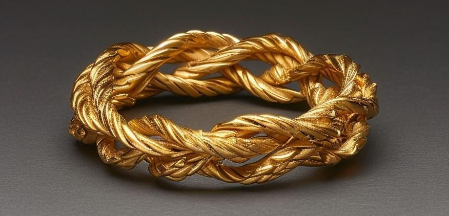

# Ring of Displacement

- :octicons-info-24:{ .lg .middle } __Uncommon [Drankorian](<../../../history/drankorian-era/drankorian-empire.md>) Magical Ring__  
   Owned by [Delwath](<../../../people/pcs/dunmar-fellowship/delwath.md>)  
    :simple-dungeonsanddragons:{ .middle} [Mechanics](https://www.dndbeyond.com/magic-items/3643042-ring-of-displacement) 

{align="right"; width="320"}An unadorned ring of made of three entwined golden braids, that radiates illusion magic. It was possessed by [Agata](<../../../people/fey/agata.md>) for many years, and carried on her person. Taken by [Delwath](<../../../people/pcs/dunmar-fellowship/delwath.md>) after [Agata](<../../../people/fey/agata.md>) was slain by [Dunmar Fellowship](<../../../people/pcs/dunmar-fellowship/dunmar-fellowship.md>) in 1748. 

Seen in [Mirror of the Past](<./mirror-of-the-past.md>): 

