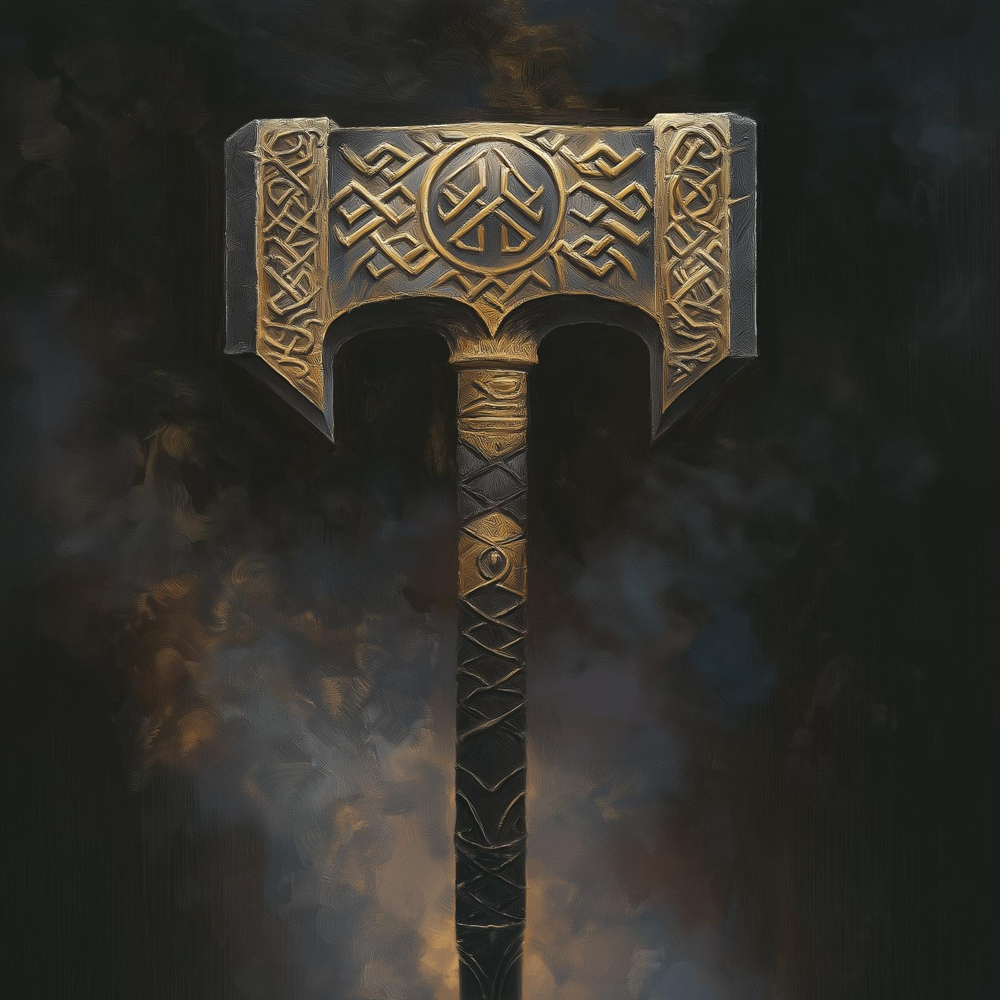

# Shatterstorm

- :octicons-info-24:{ .lg .middle } __[Dwarven](<../../../species/dwarves.md>) Magical Warhammer__  
   Owned by [Riswynn](<../../../people/pcs/dunmar-fellowship/riswynn.md>)  
    :simple-dungeonsanddragons:{ .middle} [Mechanics](https://www.dndbeyond.com/magic-items/2172493-shatterstorm) 

{align="right"; width="400"}Shatterstorm is a magical dwarven warhammer, enchanted by the Brawnanvils before the [Great War](<../../../events/1500s/great-war.md>), but lost when the dwarves fled [Raven's Hold](<../../../gazetteer/greater-dunmar/dunmari-basin/raven-s-hold.md>) in the chaos of the [Great War](<../../../events/1500s/great-war.md>). 

Recovered by [Riswynn](<../../../people/pcs/dunmar-fellowship/riswynn.md>) and the [Dunmar Fellowship](<../../../people/pcs/dunmar-fellowship/dunmar-fellowship.md>) from the [dwarven outpost](<../../../gazetteer/greater-dunmar/dunmari-basin/dwarven-outpost-raven-s-hold.md>) near Raven's Hold in DR 1748, and now wielded by [Riswynn](<../../../people/pcs/dunmar-fellowship/riswynn.md>). 
