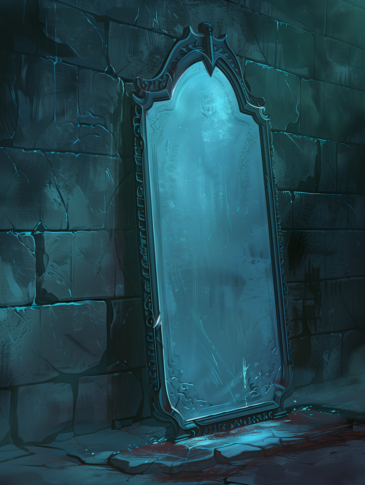

# The Mirror of Soul Trapping

- :octicons-info-24:{ .lg .middle } __Mirror__  
   Created unknown hobgoblin wizard  
   Owned owned by the [Dunmar Fellowship](<../../../../people/pcs/dunmar-fellowship/dunmar-fellowship.md>)  

:octicons-location-24:{ .lg .middle } Currently stored on [Vindristjarna](<../../../../things/ships/vindristjarna.md>), owned by the [Dunmar Fellowship](<../../../../people/pcs/dunmar-fellowship/dunmar-fellowship.md>)

{align="right"; width="400"}This 4’ heavy silvered mirror, weighing around 50 lb, is made of solid metal, polished to a silvered reflective surface on one side. The back side is etched in numerous strange languages, which [Delwath](<../../../../people/pcs/dunmar-fellowship/delwath.md>) understood to be incantations binding twelve extradimensional cells to the mirror.

Seen in [The Mirror of the Past](<../treasure-from-stormcaller-tower/the-mirror-of-the-past.md>): [Mirror of Soul Trapping Vision](<../../mirror-visions/mirror-of-soul-trapping-vision.md>)

An extradimensional cell is an infinite expanse filled with thick fog that reduces visibility to 10 feet. Creatures trapped in the mirror's cells don't age, and they don't need to eat, drink, or sleep. A creature trapped within a cell can escape using magic that permits planar travel. Otherwise, the creature is confined to the cell until freed. If the mirror is destroyed, all creatures trapped within are released.

Any creature that sees its reflection in the mirror while within 30 feet of it must make a DC 15 Charisma save or be trapped in one of the cells. This saving throw is made with advantage if the creature is aware of the nature of the mirror. 

#### Command Words
The mirror can be controlled by command words, which must be spoken within 60 feet of the mirror to function, and require an action to invoke. You know five command words: 

1) When spoken, allows you to activate or deactivate the trapping function of the mirror. Learned in [Session 32 (DuFr)](<../../session-notes/session-32-dufr.md>). 
2) When spoken, allows you to release a creature contained in one cell which you identify by number. Learned via Identify when mirror was first discovered, in [Session 30 (DuFr)](<../../session-notes/session-30-dufr.md>). 
3) When spoken in combination with the name of a creature in the mirror, allows you to summon the named creature to the surface, which allows you to speak with them. The mirror must be inactive for this command to function. Learned in [Session 32 (DuFr)](<../../session-notes/session-32-dufr.md>). 
4) When spoken in combination with the number of a cell, allows you to summon the creature in that cell to the surface, which allows you to speak with them. The mirror must be inactive for this command to function. Learned in [Session 49 (DuFr)](<../../session-notes/session-49-dufr.md>).
5) When spoken in combination with two cell numbers, allows you to open a portal between the two cells indicated by number. You currently do not know a way to close this portal. Learned in [Session 49 (DuFr)](<../../session-notes/session-49-dufr.md>). 

You sense there may be other command words, but further study or research on the item would be required to learn them.
#### Occupants
Current occupants of the mirror are:

1. [Revaka](<../../../../people/other-nonhumans/revaka.md>), a hobgoblin, trapped by [Agata](<../../../../people/fey/agata.md>).
2. [Hektor](<../../../../people/chardonians/hektor.md>), trapped in [Session 78 (DuFr)](<../../session-notes/session-78-dufr.md>) 
3. A wyvern, trapped in [Session 43 (DuFr)](<../../session-notes/session-43-dufr.md>). 
4. Kinzal mage and messenger, trapped in [Session 96 (DuFr)](<../../session-notes/session-96-dufr.md>)
5. [Valius](<../../../../people/chardonians/valius.md>)/[Vargus](<../../../../people/chardonians/vargus.md>), trapped in [Session 78 (DuFr)](<../../session-notes/session-78-dufr.md>). Cells merged into one in [Session 79 (DuFr)](<../../session-notes/session-79-dufr.md>).
6. (removed when the cells holding Valius and Vargus were merged)
7. [Antonia](<../../../../people/chardonians/antonia.md>), trapped in [Session 78 (DuFr)](<../../session-notes/session-78-dufr.md>)
8. [Vola](<../../../../people/chardonians/vola.md>), trapped in [Session 78 (DuFr)](<../../session-notes/session-78-dufr.md>)
9. empty
10. empty
11. empty
12. empty
#### Former Occupants
- A poison troll, trapped in [Session 45 (DuFr)](<../../session-notes/session-45-dufr.md>), was released at in the [Shadowkeep](<../../../../gazetteer/northern-green-sea/shadowkeep.md>) in [Session 96 (DuFr)](<../../session-notes/session-96-dufr.md>). 
#### Research Notes

[Seeker](<../../../../people/pcs/dunmar-fellowship/seeker.md>) and [Delwath](<../../../../people/pcs/dunmar-fellowship/delwath.md>)’s research in [Karawa](<../../../../gazetteer/greater-dunmar/realms/dunmar/eastern-dunmar/karawa.md>), early June 1748:

[Seeker](<../../../../people/pcs/dunmar-fellowship/seeker.md>) and [Delwath](<../../../../people/pcs/dunmar-fellowship/delwath.md>) spend a day poking around at the mirror, studying it, trying to learn as much as possible about how it works.

The first clue comes from realizing that there are hidden letters, in Goblin, etched on the back of the mirror, that seem to be more bindings and enchantments that control the ways the extradimensional prison cells are accessed. You had already noted the scripts and enchantments that created the cells themselves, but this is new.

However, it takes a long time to figure out how to translate this into action. After some careful trials, you discover command words 1 and 3. 

You feel that this is not all the secrets of the mirror, but you have exhausted what you can learn by examination and trial alone, you would need to do research on magic mirrors, hobgoblin magic, extradimensional prisons, or similar topics to learn more.

[Seeker](<../../../../people/pcs/dunmar-fellowship/seeker.md>)’s research in [Chardon](<../../../../gazetteer/west-coast/chardonian-empire/chardon/chardon.md>), August 1748. 

Reading the book that Ulfgar got for you from the [Great Library](<../../../../gazetteer/west-coast/chardonian-empire/chardon/great-library.md>) on magical mirrors, their construction and use, you learn command words 4 and 5. 

