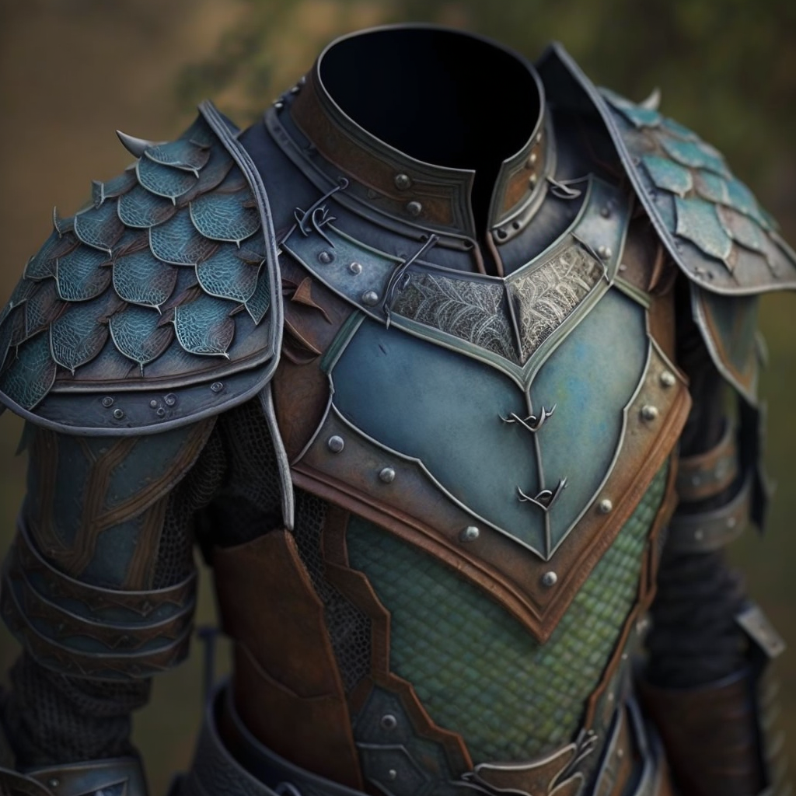

# Deno'qai Scale Mail
>[!info]+ Information
> (uncommon magical armor)
> [Mechanics](https://www.dndbeyond.com/magic-items/5372382-denoqai-scale-mail)
> 
>> 

A suit of scale mail armor, subtly designed with tanshi motifs, and lightweight enough to be worn under winter gear. It has green and blue highlights, but is otherwise muted brown.

This armor was created during the [Great War](<../../../../events/1500s/great-war.md>) for the Deno'qai hero [Balati](<../../../../people/historical-figures/balati.md>), and later gifted to [Delwath](<../../../../people/pcs/dunmar-fellowship/delwath.md>) of the [Dunmar Fellowship](<../../../../people/pcs/dunmar-fellowship/dunmar-fellowship.md>) while he was on a quest to free lost tanshi who had been trapped during the [Great War](<../../../../events/1500s/great-war.md>). 

{width="500"}