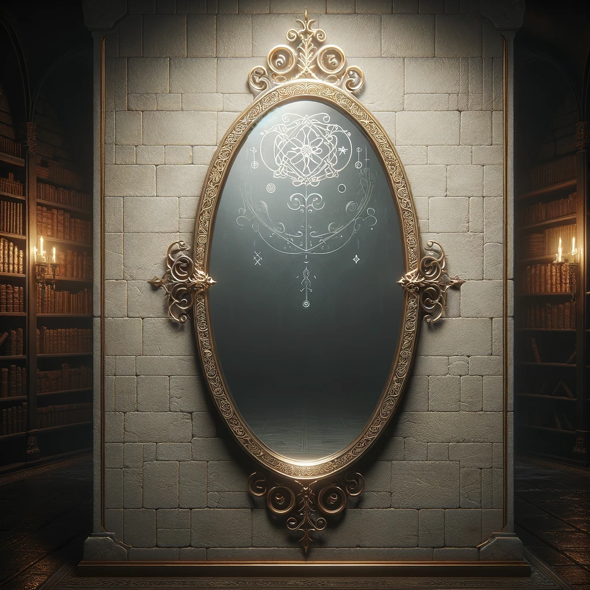

# Eudomes' Mirror of the Past

- :octicons-info-24:{ .lg .middle } __Very Rare Mirror__  
    :simple-dungeonsanddragons:{ .middle} [Mechanics](https://www.dndbeyond.com/magic-items/2739459-eudomes-mirror) 

A large ornate wall mirror, originally mounted in [Eudomes](<../../../../people/historical-figures/eudomes.md>)' bedroom in [Stormcaller Tower](<../../../../gazetteer/greater-dunmar/dunmari-basin/stormcaller-tower.md>). The mirror is about 4 feet tall and 1 foot wide, and mounted in a heavy gold filigree frame. 

When an object is shown to the mirror and a question is asked, the mirror shows scenes of the item, potentially reflecting the question asked, depending on the insight and willpower of the question asker.

This particular mirror was found by Delwath while [exploring Stormcaller Tower](<../../session-notes/session-16-dufr.md>). Its ability to show the past was inadvertently discovered by Delwath when he asked the mirror how to get out of Eudomes' bedroom while a reflection of the door could be seen, which revealed images of people who had come and gone through the door. 

