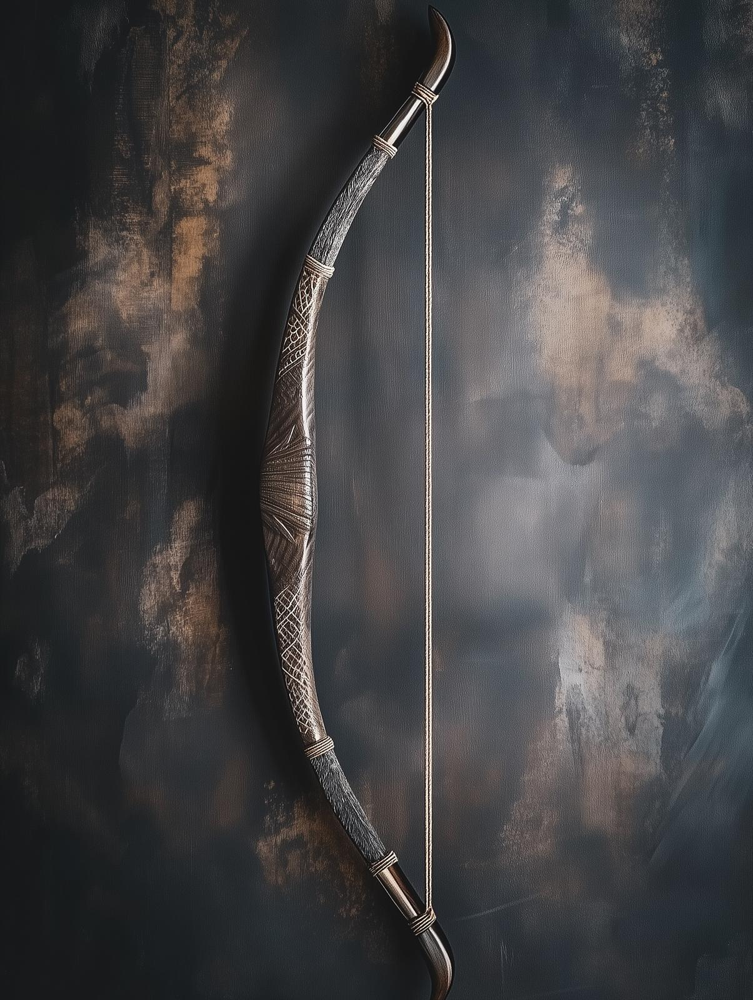

# The Wayfarer's Bow

- :octicons-info-24:{ .lg .middle } __Legendary Magic Bow__  
   Owned by [Wellby](<../../../people/pcs/dunmar-fellowship/wellby.md>)  
    :simple-dungeonsanddragons:{ .middle} [Mechanics](https://www.dndbeyond.com/magic-items/9218851-wayfarers-bow-shortbow) 

{align="right"; width="400"}This wooden bow is made of an unusual dark wood, much harder than any mundane wood but incredibly light and flexible. 

This bow was part of the hoard of the black dragon [Ra'ghemdros](<../../../people/other-nonhumans/ra-ghemdros.md>), kept on display as part of her collection of rare and unusual items. It is now carried by [Wellby](<../../../people/pcs/dunmar-fellowship/wellby.md>).

