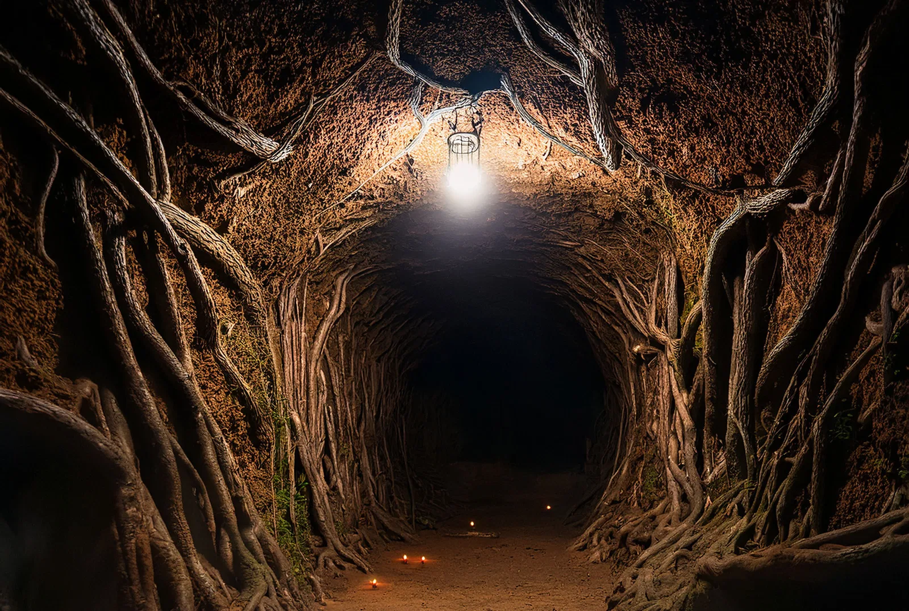

# Lost in the Feywild - Episode 01

>[!info] Welcome to Dandelion House: in which the party enters a mysterious tunnel
> *Featuring: [Kaito Min](<../../../people/pcs/other-pcs/tollen-misfits/kaito-min.md>), [Edric](<../../../people/pcs/other-pcs/tollen-misfits/edric.md>), [Tarek](<../../../people/pcs/other-pcs/tollen-misfits/tarek.md>), [Ayveen](<../../../people/pcs/other-pcs/tollen-misfits/ayveen.md>), [Txarro](<../../../people/pcs/other-pcs/tollen-misfits/txarro.md>)*
> *In Taelgar: Oct 03, 1740 DR*
> *On Earth: Thursday, May 14, 2026*
> *Varrow Forest and Dandelion House*

The party follows Alden to Dandelion House, where they accept Lord Holda's deal to end a mysterious treaty with an entity beyond a hidden door in exchange for promises of wealth and treasure, but find themselves sealed in a strange passage.

> [!quote] 
> *Locked in a room in the basement is the doom of the house.* - Lord Holda
> ...
> *What could go wrong?* - Kaito Min
## Audio Highlights

- **Lord Holda recounts his adventuring life and the bargain tied to the treaty beyond the basement door:** 
- **The party descends through the manor basement into the root-covered lower cellar where Holda waits by the hidden door:** 

## Timeline

- Oct 03, 1740 DR, evening: The party camps in the Varrow Forest with Alden, and recounts their last job around the campfire.
- Oct 04, 1740 DR: Alden leads the party through Varrow Forest to Dandelion House.
- Oct 04, 1740 DR, evening: The party enters Dandelion House, meets Lord Holda, and accepts his job offer, requiring them to pass through a basement door and convince an unknown lord to end a long-held treaty.
- Oct 05, 1740 DR, dawn: The party enters the basement root tunnel, and is sealed inside.

## Narrative

> [!image|right]
> 
> *Walking through Varrow Forest*

Our session begins as the party is traveling west from Tollen, guided by Alden -- a small, stout, pale human with a curiosity about the party and a phobia of fire -- to an old property at the end of the wilderness recently inherited by a longtime adventurer. 

The group is a found-family band of misfits: skeptical, generous, opportunistic, anxious, and fond of one another. Around the campfire, [Txarro](<../../../people/pcs/other-pcs/tollen-misfits/txarro.md>) prepares fish and recalls being rescued from tree blights by Kaito and [Tarek](<../../../people/pcs/other-pcs/tollen-misfits/tarek.md>); Kaito and [Tarek](<../../../people/pcs/other-pcs/tollen-misfits/tarek.md>) sketch out their carny and pickpocket routines; Edric's awkward generosity and faith in [the Night Queen](<../../../gods-and-religions/gods/incorporeal-gods/mos-numena-pantheon/the-night-queen.md>) comes into focus; and [Ayveen](<../../../people/pcs/other-pcs/tollen-misfits/ayveen.md>) frames the party as people who can make the world brighter. Over dinner, Alden asks about their last job together, when an elf in Tollen hired them to recover old books from an ettin. They each tell a different version of the story: Kaito remembers profit and clean clothes; [Edric](<../../../people/pcs/other-pcs/tollen-misfits/edric.md>) remembers enemies who ran instead of dying; [Tarek](<../../../people/pcs/other-pcs/tollen-misfits/tarek.md>) remembers salvage; [Txarro](<../../../people/pcs/other-pcs/tollen-misfits/txarro.md>) remembers becoming a tiger; and [Ayveen](<../../../people/pcs/other-pcs/tollen-misfits/ayveen.md>) sees teamwork. 

Alden then speaks of Dandelion House with rapturous but genuine emotion -- Kaito's surreptitious Detect Thoughts spell finds joy, delight, longing, and nostalgia. As the party drifts off to rest, the night passes uneventfully.

Morning brings a long march through ancient forest. The trail slowly fades away, the forest grows quieter, the shadows gather. Just before sunset, the party passes through a ruined gate and over barely-visible remnants of an ancient wall and moat long since swallowed by forest. The forest opens into a wildly overgrown field and the House itself, blazing bright in the last light of day.

Dandelion House is a marvel of late-Drankorian architecture -- at least 700 years old. Detect Magic suggests some kind of preservation magic woven through the much of the structure, but Kaito becomes increasingly convinced that the house -- with its empty window frames like eye sockets and open double doors like a mouth with a dandelion crest above it -- is waiting to consume them.

Alden warns that Lord Holda is proud, difficult, and desperate for Dandelion House to become the estate he has always wanted. They meet Lord Holda on the upper floor: a scarred adventurer in his late 40s, watching the fading light, sinking into shadow. After brief introductions, Holda leads them down to the kitchen for a meal and conversation.

> [!image]
> 
> *Dandelion House*

Holda tells his story over dinner in a kitchen stocked with magical conveniences (including a cleaning bar [Tarek](<../../../people/pcs/other-pcs/tollen-misfits/tarek.md>) immediately evaluates for later theft). The second son of a minor lord in southern Sembara, he always hungered for more. Disappointed in the modest comfort of his family and resentful about his station, he left to seek his fortune, spending decades around the [Green Sea](<../../../gazetteer/green-sea.md>) as a sellsword, adventurer, and mercenary. He made and lost treasurers and lovers, and acquired a minor reputation. 

Holda tells it all with a deep, weary bitterness: the best is clearly behind him and it wasn’t that great anyway. Each year was different but every year was the same: a wheel turning endlessly until this last spring. A dragon had come wandering south from the mountains and his party slew it in a fight which claimed the lives of every other member of his party. The deed was made into a popular song, but Holda found himself back in Tollen with his companions dead and his purse no heavier than when he left home nearly 30 years earlier. 

But then, in a voice both wondering and grim, Holda says that the next day, an elf calling himself an archivist delivered to Holda a centuries-old deed. Despite its age, this deed clearly named Holda, his lineage, his birth date, and a number of his exploits, including the slaying of the dragon. 

The document named him heir to "Dandelion House, its lands, and all such treasures therein," on condition that Holda steps through a door in the floor and convinces a man beyond it to end a long-held treaty. But Holda -- whose only negotiation strategy seemed to be intimidation -- failed almost immediately to convince the man of anything, and now has turned to the party for help.

After Holda leaves them, [Tarek](<../../../people/pcs/other-pcs/tollen-misfits/tarek.md>) reads the Sembaran document again and senses that something about it does not fit. But Kaito shifts from fear to enthusiasm at the promise of half the hoard -- though [Ayveen](<../../../people/pcs/other-pcs/tollen-misfits/ayveen.md>) points out that ending an unknown treaty might be dangerous, and [Txarro](<../../../people/pcs/other-pcs/tollen-misfits/txarro.md>) tries to prepare Kaito for disappointment if the treasure is a trap, a metaphor, or a single coin. They still decide they have come too far not to investigate, and prepare to enter the door in the morning.

> [!image|left]
> 
> *The root tunnel to the unknown*

Before dawn, the grandfather clock wakes them and Alden collects them from their rooms, leading them through the ground floor, down through a massive basement. There, he opens a locked door with a glowing gold key, leads them below the basement, down through a passage hewn from living rock into in a root-covered sub-cellar that surely predates the manor above it. Holda, waiting there, opens a door that seems to lead deep through a massive hollowed-out root, promising to keep this end open while they take care of business. 

"On the far side, go up, up and out and onto the road," he tell them, "and you'll see the manor just ahead a little way. Seek there the master of the house." Just as Holda closes the door behind them, [Tarek](<../../../people/pcs/other-pcs/tollen-misfits/tarek.md>) realizes the contract is unquestionably four hundred years old but written in perfectly contemporary Sembaran.

## Cast of Characters

- Alden (he/him, human): guide and agent for Lord Holda.
- Colden (he/him, human): Alden's cousin, at the manor.
- Mossfoot(companion): Edric's pony.
- Lord Holda (he/him, Sembaran human): lord of Dandelion House, former adventurer, and mysterious quest-giver.

## Places

- Varrow Forest (forest in [Sembara](<../../../gazetteer/greater-sembara/sembara/sembara.md>), [Greater Sembara](<../../../gazetteer/greater-sembara/greater-sembara.md>)): old forest west of Tollen that the party travels through to reach Dandelion House. Session context includes: campfire; long day's hike through increasingly trackless forest.
- Dandelion House (manor house in the Varrow Forest, [Sembara](<../../../gazetteer/greater-sembara/sembara/sembara.md>)): ancient preserved manor and overgrown estate claimed by Lord Holda, beautiful and decrepit in equal measure. Session context includes: grounds, entry hall, upper floors, kitchen, guest quarters, basement, root cellar, and and hidden root tunnel.
