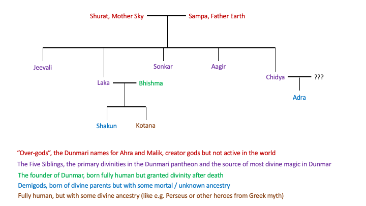

# Dunmari Pantheon

The Dunmari worship a tight pantheon of divinities they believe represent the Divine Family. These include five siblings, and associated demigods. 

**The Five Siblings**
- [Jeevali](<./jeevali.md>), the goddess of life, rebirth, home, and family; often the major deity associated with temples that are the center of worship in villages and small temporary settlements across [Dunmar](<../../../../gazetteer/greater-dunmar/realms/dunmar/dunmar.md>).
- [Aagir](<./aagir.md>), the god of war, fire, and death; protector of soldiers and defender of honor of the Dunmari. 
- [Sonkar](<./sonkar.md>), the goddess of beauty, truth, artisans, and justice. 
- [Laka](<./laka.md>), the god of knowledge, agriculture, and the seasons; often associated with centers of learning.
- [Chidya](<./chidya.md>), the goddess of nature, the land, animals, and weather; worshiped especially by herders and shepherds and those who live a nomadic life.

The Dunmari also acknowledge the power of the creator gods, [Shurat](<../../high-gods/divine-presence.md>) and [Sampa](<../../high-gods/divine-presence.md>), and worship other minor gods:
- [Shakun](<./shakun.md>)
- [Bhishma](<./bhishma.md>)
- [Adra](<./adra.md>)

### Relationships among the Divine

