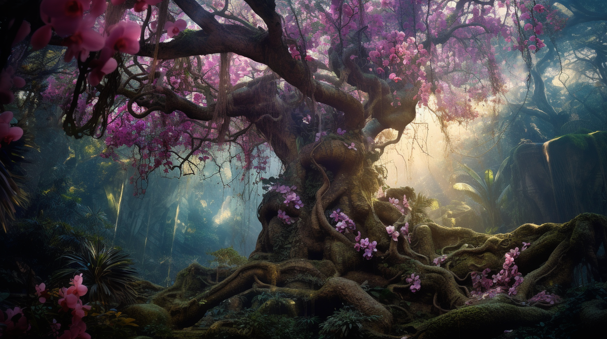

# Dreamhaven

-    :octicons-location-24:{ .lg .middle } A [Fey](<../../../../species/children-of-the-divine/fey/fey.md>) realm [Feywild](<./feywild.md>)  

Dreamhaven is an ancient forest, full of hidden paths, secret groves, and unexpected discoveries. In places, the forest is bright, lit by the perpetual afternoon sunlight of Dreamhaven, and dotted with sudden meadows of blooming flowers, or towering trees draped with orchids. Elsewhere, the forest grows dense and close, and deep shadows cast a perpetual twilight gloom on the forest floor. The trees shift, and there are few reliable paths through Dreamhaven. 

Dreamhaven is ruled by Lady Seraphine, Warden of the Wood and Guardian of the Living Dream. She has long maintained alliances with the elves of Taelgar, and draws to her court those who see clearly the hidden messages of the forest. 

The people of Dreamhaven live in small enclaves, usually hidden out of sight. The court of the Lady is no grand place, but rather a clearing, an outdoor feast, that moves with her, as the trees of her forest step aside to allow her to pass. 

## Location

Dreamhaven is north of [Fortune's Rest](<./fortune-s-rest.md>), south of [Whispervale](<./whispervale.md>), and east of [Splendor's Gleam](<./splendor-s-gleam.md>), to the extent that geography can be straightforwardly described in the Feywild. 

Dreamhaven is roughly congruent with the  ancient elven kingdom of Ainumarya and the northern reaches of the Chasa River Valley on the Material Plane. 

## Visual Inspiration

