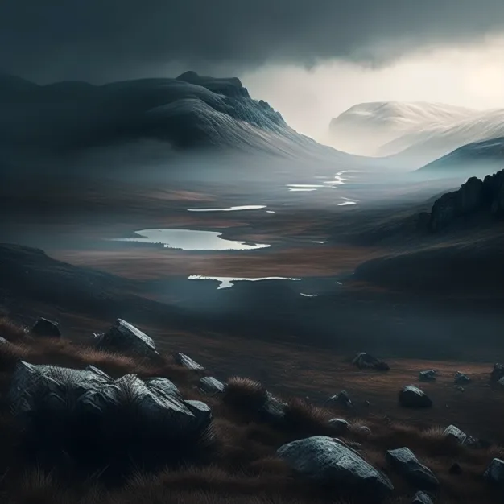
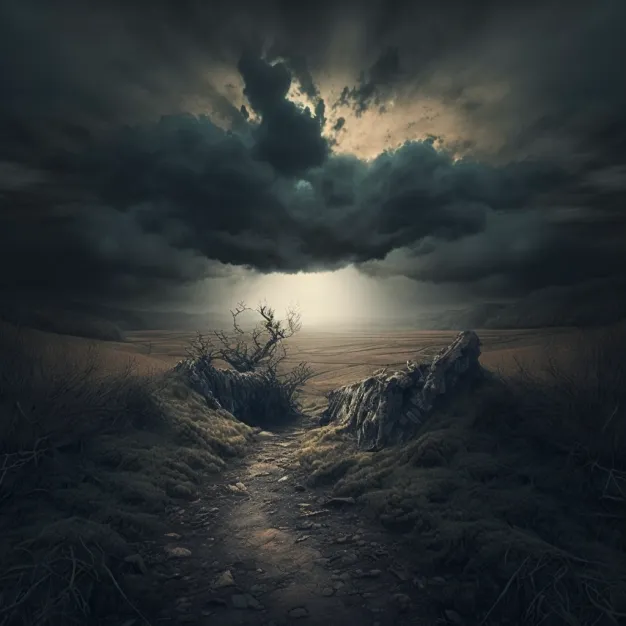

# Duskmire

-    :octicons-location-24:{ .lg .middle } A realm [Feywild](<./feywild.md>)  

A fey realm, the domain of  [Lord Umbraeth](<../../../../people/extraplanar-powers/lord-umbraeth.md>), often known as the Gloomshaper. Duskmire is a bleak place, a land of endings and cruelty. The sky is often full of clouds, often blotting out the weak sun, constantly hovering on the horizon. Storms race across the realm with some frequency bringing thunder and cold rain. 

The scenery is mixed, with a central core of several very tall mountains,  surrounded by a dense and overgrown forest. Four rivers of brown water flow from the mountains to the east, west, north, and south and beyond the forest the realm is craggy hills and cold moors. 

The realm is bordered to the south by [Amberglow](<./amberglow.md>), to the west by [Dreamhaven](<./dreamhaven.md>), to the north by Unnamed Powerful Northern Fey, and to the east by [Twilight's Grace](<./twilight-s-grace.md>).

Lord Umbraeth enjoys sport, and especially cruel sport where the game is rigged and the stakes high. Like all fey, he does not break his deals, but he is often misleading in his explanations and delights in the despair of his victims when they discover his deal was not fair. 

Lord Umbraeth was not always the lord of a fey realm. Thousands of years ago he was a powerful courtier in the court of Ethlenn, where he was held in some respect, even if he was not loved. 

