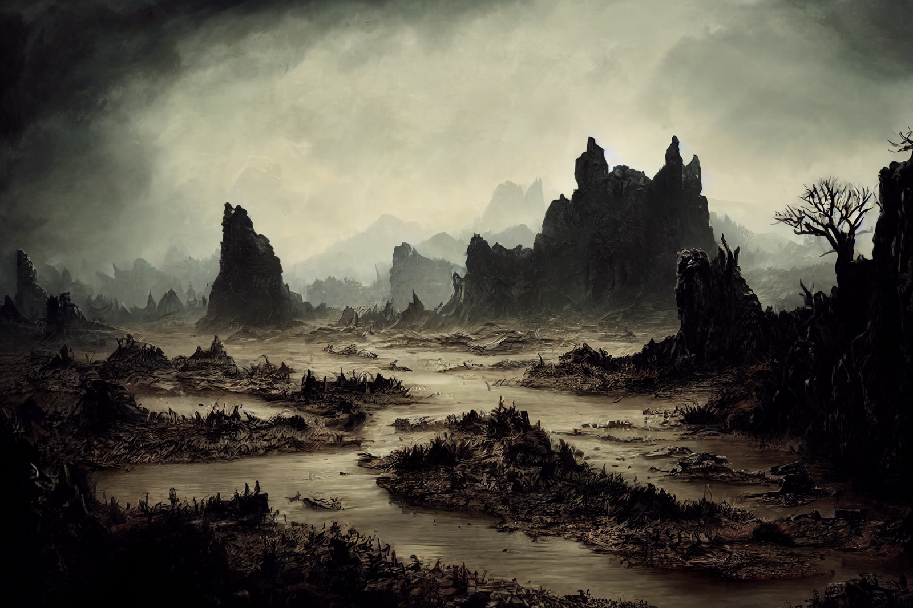
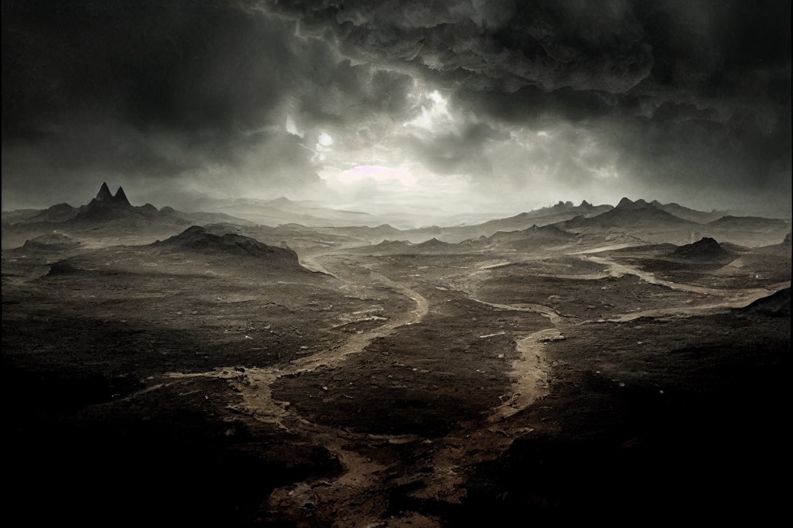

# Morkalan

-  
   :octicons-location-24:{ .lg .middle } A [Shadowfell](<./shadowfell.md>) domain, brought into being on DR 1570 in [Hagrim](<../../../../people/dwarves/hagrim.md>)  
    :octicons-location-24:{ .lg .middle } Destroyed on August 26th, 1748 by [Riswynn](<../../../../people/pcs/dunmar-fellowship/riswynn.md>) and companions  

Morkalan was created by the dwarf [Hagrim](<../../../../people/dwarves/hagrim.md>) in death, as he turned from the gods. Known as the Land of the Dishonored Dead. A small domain, one that can be crossed in a day. A place where the sky is always dim and shadowed, the horizon bounded by endless mists.

Largely inhabited by dwarves trapped at the creation of this domain, and the occasional other poor soul who was drawn in and could not escape. 

Also the name that [Hagrim](<../../../../people/dwarves/hagrim.md>) took as he grew to identify with the domain, and forgot his past. 

The muddy river:
{width="500"}

The ash plains:
{width="500"}

In August of 1748, the Chalice of the Runepriest was recovered by the dwarf adventurer Riswynn. Through it, she was drawn to the realm of the [Bahrazel](<../../../gods/embodied-gods/bahrazel.md>), the Heart of the Mountain, and sent (with three companions repaying debts to the [Bahrazel](<../../../gods/embodied-gods/bahrazel.md>)) to Morkalan. [Hagrim was defeated ](<../../../../campaigns/dunmari-frontier/session-notes/session-53-54-dufr.md>)and the waters of the Chalice of the Runepriest shattered the fabric of the domain, destroying it. 
