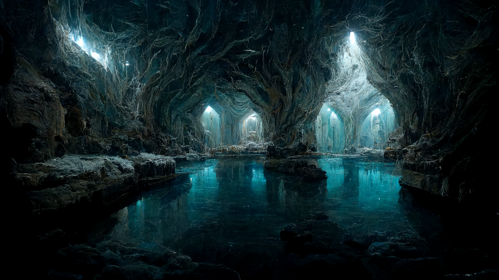

# The Heart of the Mountain
>[!info]+ Information
> A plane in the Divine Realms, the Spiritual Realms

The divine realm of the [Bahrazel](<../../../gods/embodied-gods/bahrazel.md>). 

Described in various ways, but often as a vast cavern hundreds and hundreds of feet across. Small motes of light float in the air, causing the flecks of white gemstones and silver veins that run through the walls of the cave to glitter and sparkle. In the center of the open space is a perfectly smooth pool of water, deep and dark. The only sound is the distant, rhythmic clang of hammer on iron, ringing almost like a bell, the tempo slow but steady.

Tunnels leave the cave in all directions, many wide and brightly lit by crystal lanterns, others narrow, some nearly vanished into the shadows.

