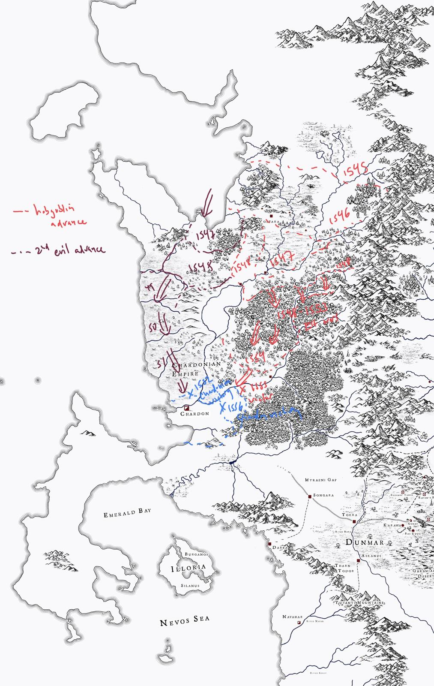

# The Conclave War

The Conclave War was one of the defining conflicts of the [Blood Years](<./blood-years.md>) in [Greater Chardon](<../../gazetteer/greater-chardon/greater-chardon.md>).  the west coast. It is remembered in Chardonian histories as the moment when a host of hobgoblins and monsters—led by a conclave of dragons—advanced down the [Chasa](<../../gazetteer/major-rivers/chasa-nahadi-watershed/chasa.md>) river valley and brought the war to the doorstep of [Chardon](<../../gazetteer/greater-chardon/chardonian-empire/chardon/chardon.md>).

The war’s key turning point was the [Battle of Metium](<./battle-of-metium.md>), fought only a few days’ ride upriver from Chardon, where the dragon host was checked and its leadership shattered.

## Notable Battles

- [Battle of Kin-Aska](<./battle-of-kin-aska.md>)
- [Battle of Shadowfire](<./battle-of-shadowfire.md>)
- [Battle of Metium](<./battle-of-metium.md>)

## Sources

- [Battle of Kin-Aska](<./battle-of-kin-aska.md>)
- [Battle of Shadowfire](<./battle-of-shadowfire.md>)
- [Battle of Metium](<./battle-of-metium.md>)
- [Great War](<./great-war.md>)
- [Greater Chardon](<../../gazetteer/greater-chardon/greater-chardon.md>)

