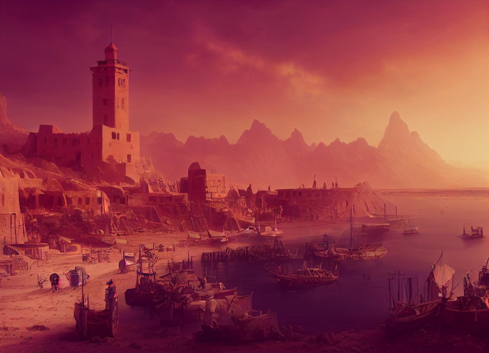

# Medju

-    :octicons-location-24:{ .lg .middle } A city in the [Eastern Green Sea](<./eastern-green-sea.md>)  

The great spice city in the south, the terminus of trade routes from strange lands across the desert, where you can buy and sell almost anything in the markets of  the obscenely wealthy spice lords.

