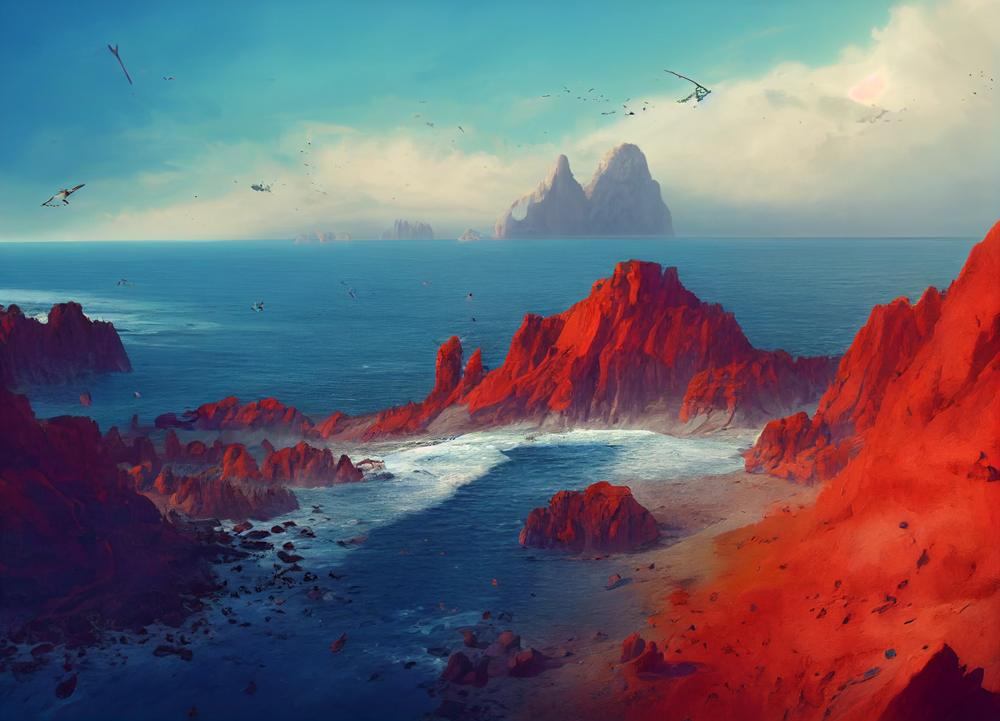

# The Vermillion Isles

-    :octicons-location-24:{ .lg .middle } An archipelago in the ~Eastern Islands~, the [Green Sea](<../green-sea.md>)  

The Vermillion Isles, called Chasoka (*SHA-soh-kah*) by the kenku who inhabit them, are an archipelago in the ~Eastern Islands~ of the eastern Green Sea. These islands are formed primarily from red stone, creating dramatic red cliffs that rise from the ocean, and red stone pillars the dot the scrubby, semi-arid interior of the islands.

*The red cliffs of the Vermillion Isles*

The kenku have inhabited these islands for living memory, and this old and proud kenku civilization is somewhat aloof towards the grounders, as they call those who cannot fly. While friendly and welcoming of trade, the kenku build their towns and villages high on cliffs, largely inaccessible to those who cannot fly. While there are humans and others that live on these islands, often settling in sheltered valleys between towering red sea cliffs, they are a distinct minority.

*The Vermillion Isles*
