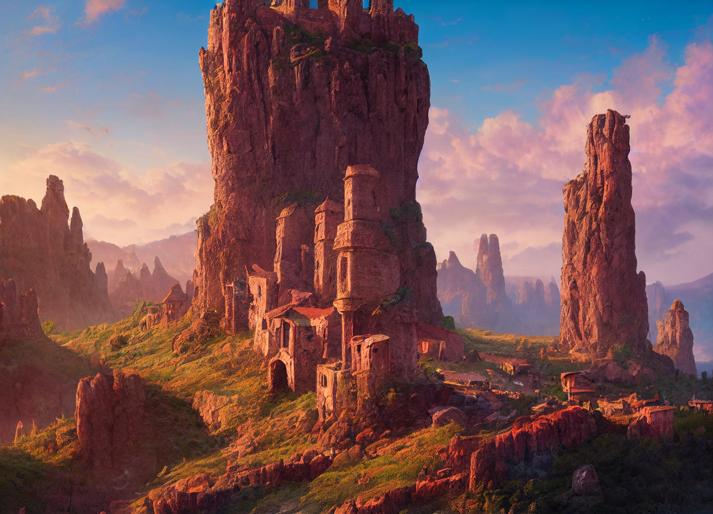

# Wahacha

-    :octicons-location-24:{ .lg .middle } A Kenku port town in the [Vermillion Isles](<./vermillion-isles.md>), the [~Eastern Islands~](<./eastern-islands.md>), the [Green Sea](<../green-sea.md>)  

Wahacha is one of several notable ports in the [Vermillion Isles](<./vermillion-isles.md>), inhabited primarily by Kenku. The low port, including the harbor, docks, trading houses, and a few taverns and sailor's inns, is set along the water, below towering cliffs of red stone. The main part of town is built in and among the red stone pillars that dot the landscape, with many buildings clinging impossibly to the sides of cliffs, inaccessible except by flight.

*The red pillars of Wahacha are home to many Kenku*

While nominally welcoming of outsiders, the Kenku of Wahacha do little to make their homes and villages accessible to those without wings, and most of the grounders, as they call the flightless people -- [Humans](<../../species/children-of-divine-creation/humans/humans.md>), mostly, but some [halflings](<../../species/children-of-the-embodied-gods/halflings/halflings.md>) and others -- live in a few small clusters of buildings around the main harbor.

Wahacha is primarily known for the chiles that grow in the sheltered valleys outside of town, which are dried and powdered to produce a spice highly valued across the [Green Sea](<../green-sea.md>). 