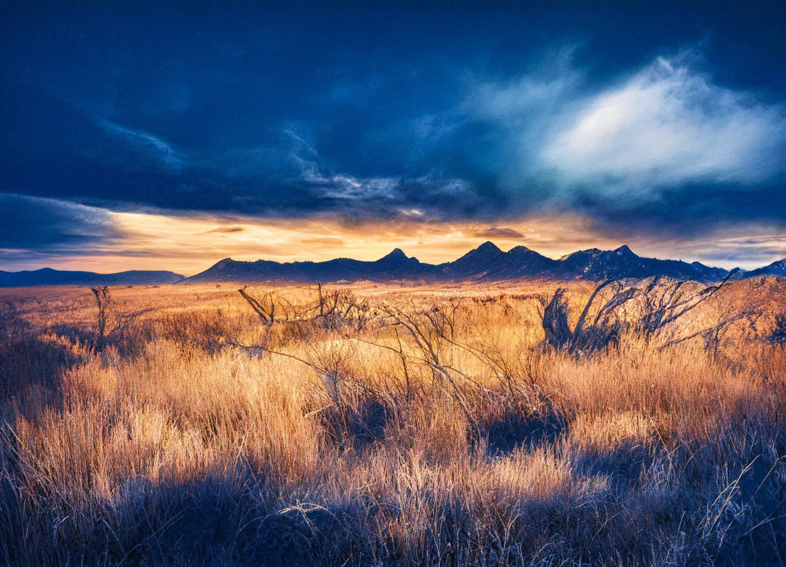

# Amberglow

-    :octicons-location-24:{ .lg .middle } A [Fey](<../../../../species/extraplanar/fey.md>) realm in the [Feywild](<../../../../cosmology/feywild.md>), [Multiverse](<../../../../cosmology/multiverse.md>)  

Amberglow is a fey realm, located by many sources, including [The Lore of the Feywild](<../../../../things/books/the-lore-of-the-feywild.md>), on the southern and eastern borders of [Shimmersong](<../shimmersong.md>). This realm features frequently in the tales and legends of [Drankor](<../../../../history/drankorian-era/drankorian-empire.md>) as a place of great beauty, a land of constant sunsets and golden skies on wide open plains of amber grasses and lush flowers. However, more recent sources suggest that it has fallen into decay. Many fey ballads sing the tragedy of the [Cloudspinner](<../../../../people/extraplanar-powers/archfey/cloudspinner.md>), the Queen of Sunsets, who vanished long ago, and the slow destruction of her once-marvelous realm that followed. 

There are, however, some pockets of the [Cloudspinner](<../../../../people/extraplanar-powers/archfey/cloudspinner.md>)'s court that remain. [Lady Eventide](<../../../../people/fey/lady-eventide.md>) hides in the crumbled remains of the [Cloud Palace](<./cloud-palace.md>). [Caulaus](<../../../../people/pcs/dunmar-fellowship/guests/caulaus.md>), a trapped Drankorian solider who once wronged the [Cloudspinner](<../../../../people/extraplanar-powers/archfey/cloudspinner.md>) but has forgotten his mistakes, now guards the [Heartwood Grove](<./heartwood-grove.md>) where [Agata Dustmother](<../../../../people/fey/agata.md>) remains imprisoned. Rumors of other holdouts and defenders exist as well, although what truth there is to these tales is not clear. Nonetheless, the land remains a bleak place, where the vibrant colors of sunset are bleached and desaturated, and those that linger struggle against malicious fey. 

