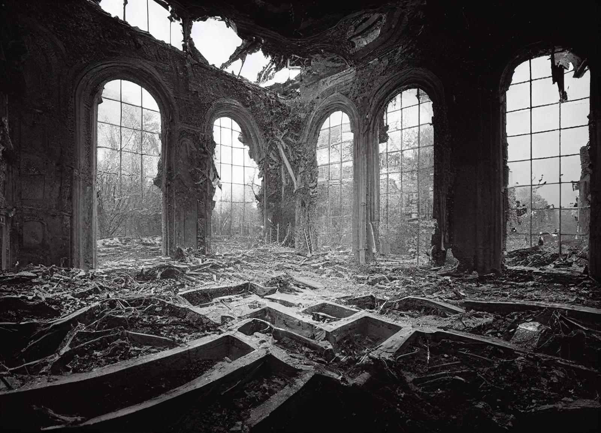

# The Cloud Palace

-    :octicons-location-24:{ .lg .middle } A [Fey](<../../../../species/extraplanar/fey.md>) palace in [Amberglow](<./amberglow.md>), [Feywild](<../../../../cosmology/feywild.md>), [Multiverse](<../../../../cosmology/multiverse.md>)  

Once the majestic floating palace of the [Cloudspinner](<../../../../people/extraplanar-powers/cloudspinner.md>), lit with the brilliant hues of sunset, the Cloud Palace is now little more than a gray, washed out ruin, haunted by the lingering members of Cloudspinner's court who refuse to leave, led by [Lady Eventide](<../../../../people/fey/lady-eventide.md>).

