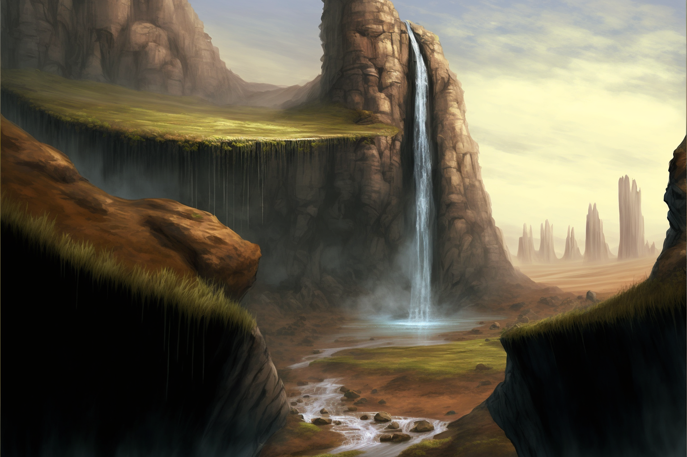

# The Lastlight Falls

-    :octicons-location-24:{ .lg .middle } A portal in [Amberglow](<./amberglow.md>), the [Feywild](<../../../../cosmology/feywild.md>), [Multiverse](<../../../../cosmology/multiverse.md>)  
    :octicons-location-24:{ .lg .middle } A portal in [Nashtkar](<../../../greater-dunmar/dunmari-basin/nashtkar.md>), the [Desolation of Cha'mutte](<../../../drankorian-hinterland/desolation-of-cha-mutte.md>), the [Drankorian Hinterland](<../../../drankorian-hinterland/drankorian-hinterland.md>)  

Lastlight Falls is a portal between the Feywild and the material plane, located in the [Nashtkar](<../../../greater-dunmar/dunmari-basin/nashtkar.md>), northwest of [Kharsan](<../../../greater-dunmar/dunmari-basin/kharsan.md>) and south of the [Sentinels](<../../../sentinel-range.md>) in the material plane, and in [Amberglow](<./amberglow.md>) in the [Feywild](<../../../../cosmology/feywild.md>). It takes the form of a waterfall with no visible source, that seems to glow with increasing intensity as the sunset approaches. 

It is possible to step through the mists of the waterfall and walk between planes, but only for a short time each day, as the portal is only open around the time of sunset in the [Material Plane](<../../../../cosmology/material-plane.md>).
