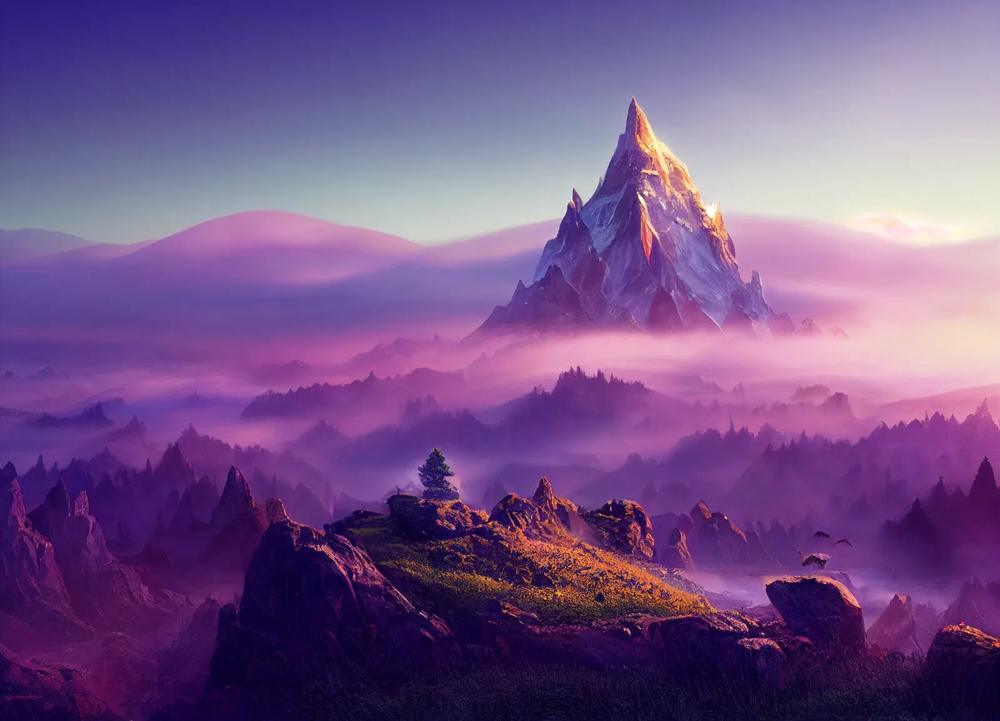

# The Crystal Peak

-    :octicons-location-24:{ .lg .middle } A mountain in the [Feywild](<../../../cosmology/feywild.md>), [Multiverse](<../../../cosmology/multiverse.md>)  

{align="right"; width="500"}A strange mountain made of solid crystal and gemstones, between the [Feywild](<../../../cosmology/feywild.md>) domains of [Fortune's Rest](<fortune-s-rest.md>) and [Shimmersong](<shimmersong.md>). The mountain is a source of magical power, and is guarded by a strange fey named [Illaran](<../../../people/fey/illaran.md>).