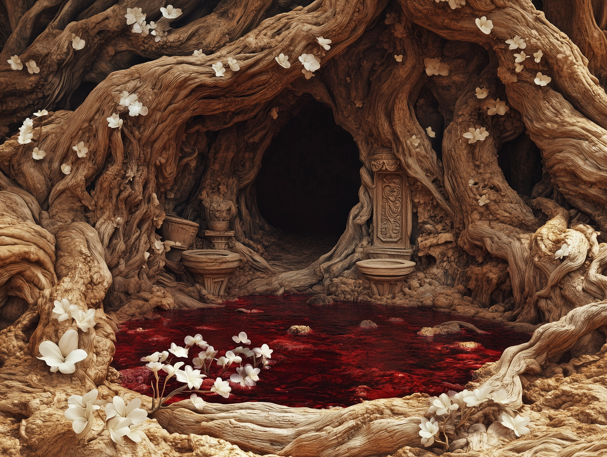

# The Bitterwine Oak

-    :octicons-location-24:{ .lg .middle } A portal in [Emberwine](<./emberwine.md>), the [Feywild](<../../../../cosmology/feywild.md>), [Multiverse](<../../../../cosmology/multiverse.md>)  
    :octicons-location-24:{ .lg .middle } A portal in the [Garamjala Desert](<../../../drankorian-hinterland/garamjala-plateau/garamjala-desert.md>), the [Desolation of Cha'mutte](<../../../drankorian-hinterland/desolation-of-cha-mutte.md>), the [Drankorian Hinterland](<../../../drankorian-hinterland/drankorian-hinterland.md>)  

{align="right"; width="500"}The Bitterwine Oak is a massive oak tree, growing seemingly without need for water, in the [Garamjala Desert](<../../../drankorian-hinterland/garamjala-plateau/garamjala-desert.md>), along the banks of the now-dry lower [Hara](<../../../greater-dunmar/rivers/hara-watershed/hara.md>), a few hundred miles northwest of the ruins of [Drankor](<../../../../history/drankorian-era/drankor.md>).

Among the tangled roots of the tree are sparkling pools of sweet-smelling wine, seeping from the roots in shallow basins. Golden ivy and pale white blossoms line the lower reaches of the massive tree, and give off an intoxicating scent. 

Those who approach the Bitterwine Oak invariably here the call of the revel: whispered calls to dance, to sing, to join the party, seemingly carried on the wine. Old Drankorian tales claim that those who acknowledge the revel vanish to the Feywild to join their fey hosts in dance and song. 

