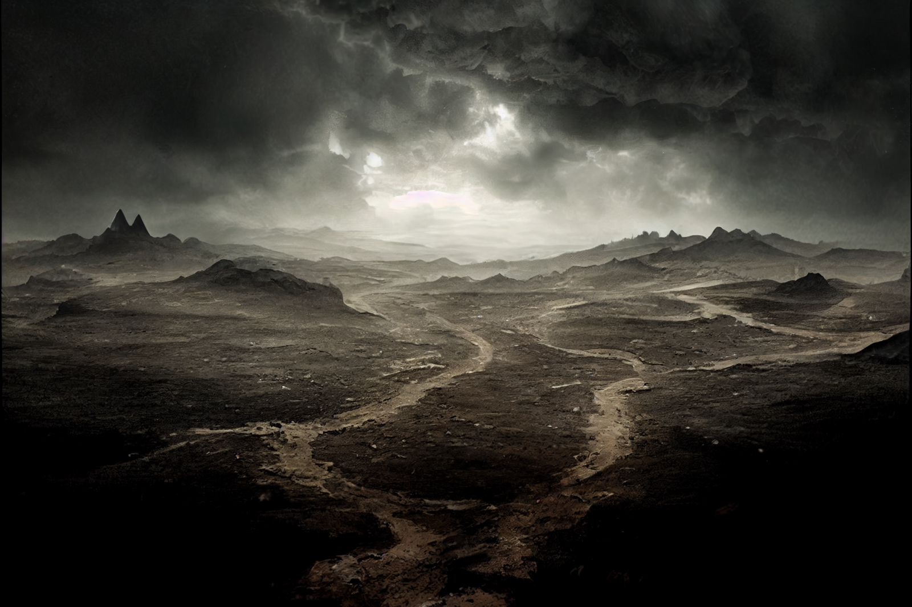
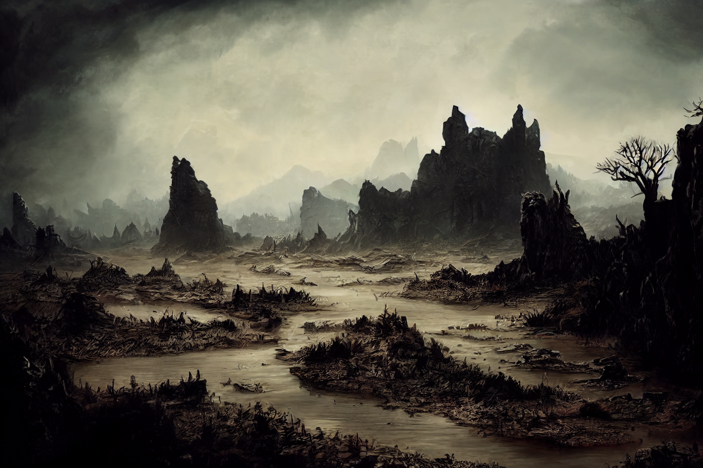

# Morkalan

-  
   :octicons-location-24:{ .lg .middle } A [Shadowfolds](<../../../../cosmology/demiplanes-and-echo-realms/shadowfolds.md>) domain, brought into being in DR 1575 by [Hagrim of Morkalan](<../../../../people/dwarves/hagrim.md>)  
    :octicons-location-24:{ .lg .middle } Destroyed on August 26th, 1748 by [Riswynn](<../../../../people/pcs/dunmar-fellowship/riswynn.md>) and companions  

Morkalan, known as the Land of the Dishonored Dead, is a rumored domain of despair and deathless life. 

{align="right"; width="500"}It was described by those who escaped as a bleak, shadowy place, a land where the sky was always dim and the faint sun could not pierce the looming clouds. It was a small place, a land that one could cross in a day or two on foot, although the few who wandered into the bleak clouds around its borders always found themselves wandering back into Morkalan from another direction some time later. 

{align="right"; width="500"}It was a land with few features to distinguish the landscape, except the [Muddy River](<./muddy-river.md>), which is presumed to be a shadowy echo of the [Hara](<../../../greater-dunmar/rivers/hara-watershed/hara.md>). On the western edge of the Muddy River, a series of cliffs and caves provided some shelter and was the location of the only notable settlement in Morkalan, known as [Bleakhold](<./bleakhold.md>). 

East of the Muddy River, the land stretched into the Ashfields, a broken, barren land where few survived, home primarily to those who lots their wits or their will, or those who disobeyed the orders of Morkalan and were exiled to become hungry ghosts in the wastes. 
## Inhabitants of Morkalan
Morkalan was inhabited primarily by dwarves who were drawn in by the curse of [Hagrim](<../../../../people/dwarves/hagrim.md>), upon his death and the creation of the domain. Few, however, who survived their years in this place can remember clearly their lives before, though some of the history that the survivors and the dwarves of [Tharn Todor](<../../../greater-dunmar/realms/nardith/tharn-todor.md>) have been able to piece together is [described elsewhere](<../../../../things/artifacts-of-power/chalice-of-the-runepriest.md>). The defining feature of the domain, according to the [servants](<../../../../people/pcs/dunmar-fellowship/riswynn.md>) of the [Bahrâzel](<../../../../gods-and-religions/gods/embodied-gods/bahrazel/bahrazel.md>) who finally destroyed it was the profound lack of a divine presence. The souls of the dead, trapped in Morkalan, were not taken up to the [Land of the Dead](<../../../../cosmology/land-of-the-dead.md>) and beyond, and over time the land became inhabited more by ghosts than any living souls. Even the people who survived seemed strangely mindless, often simply repeating routines over and over for no apparent purpose. While many, but not all, have recovered since being freed, none can clearly remember the passage of time in Morkalan. 

Although the vast majority of the inhabitants of Morkalan were dwarves, a handful of others found themselves pulled into the domain at various points, and established a small camp on the cliffs above the Muddy River. 

## Origin of Morkalan
From what can be reconstructed, it appears that Morkalan was brought into being by the madness of [Hagrim](<../../../../people/dwarves/hagrim.md>), a dwarf warrior and hero of the [Great War](<../../../../events/1500s/great-war.md>), when he, in death, betrayed his companions and turned from the gods. But Hagrim could not recall his story or his past life, having simply come to identify himself as Morkalan, the soul of Dishonor. 

## Destruction of Morkalan
In August of 1748, the Chalice of the Runepriest was recovered by the dwarf adventurer Riswynn. Through it, she was drawn to the realm of the [Bahrazel](<../../../../gods-and-religions/gods/embodied-gods/bahrazel/bahrazel.md>), the Heart of the Mountain, and sent (with three companions repaying debts to the [Bahrazel](<../../../../gods-and-religions/gods/embodied-gods/bahrazel/bahrazel.md>)) to Morkalan. [Hagrim was defeated ](<../../../../campaigns/dunmari-frontier-campaign/session-notes/session-56-dufr.md>)and the waters of the Chalice of the Runepriest shattered the fabric of the domain, destroying it. 

