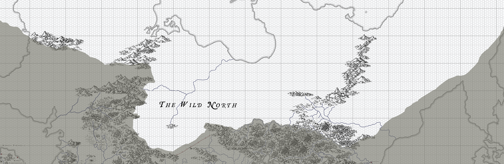

# The Far North

-    :octicons-location-24:{ .lg .middle } A region in Taelgar  

Far north, beyond the northern lands of [Vostok](<../greater-sembara/vostok/vostok.md>) and [Ursk](<../northern-green-sea/ursk/ursk.md>) lies a mysterious land of long winters and bitter cold. Rarely visited, even rumors from this region rarely reach the populated lands of the south. The stories that do reach the south tell of frost-breathing dragons, obsidian statues as tall as the hills, and singing caves of ice that devour unwary travelers. More prosaic stories of wooly mammoths with heavy ivory tusks and short summers filled with rushing snowmelt and clouds of gnats as far as the eye can see have also come south. Who is to say which stories are true?
## Map

## Topography and Major Features
Few have mapped this region, and little is known about the lands. A few features are well-attested:

* A cold, dry steppe north of [Vostok](<../greater-sembara/vostok/vostok.md>) and the [Gråstenvakt](<../greater-sembara/vostok/grastenvakt.md>)
* A range of mountains north of the [Ket](<../northern-green-sea/rivers/ket.md>), said to be the birthplace of Vimfrost and home to many frost-breathing dragons
* A river system that drains from the range of mountains north of the [Ket](<../northern-green-sea/rivers/ket.md>) to the eastern [Green Sea](<../green-sea.md>)

## Civilizations and Cultures
Although rumors persist of kenku flying across the nothern steppe, few can say where exactly these winged creatures live. 
## Climate
This region of Taelgar is nearly entirely within the subpolar or polar climates, a mix of [vast subarctic forests](https://geodiode.com/climate/subarctic) and [barren tundra](https://geodiode.com/climate/tundra). But few rumors or tales come to the south from these regions, and in the distant north, who knows what strange magic may sustain life in unlikely places?
## Major Historical Eras
Little is known of the history of this region, although [Vimfrost's War](<../../events/1500s/vimfrost-s-war.md>) was partially fought here.

