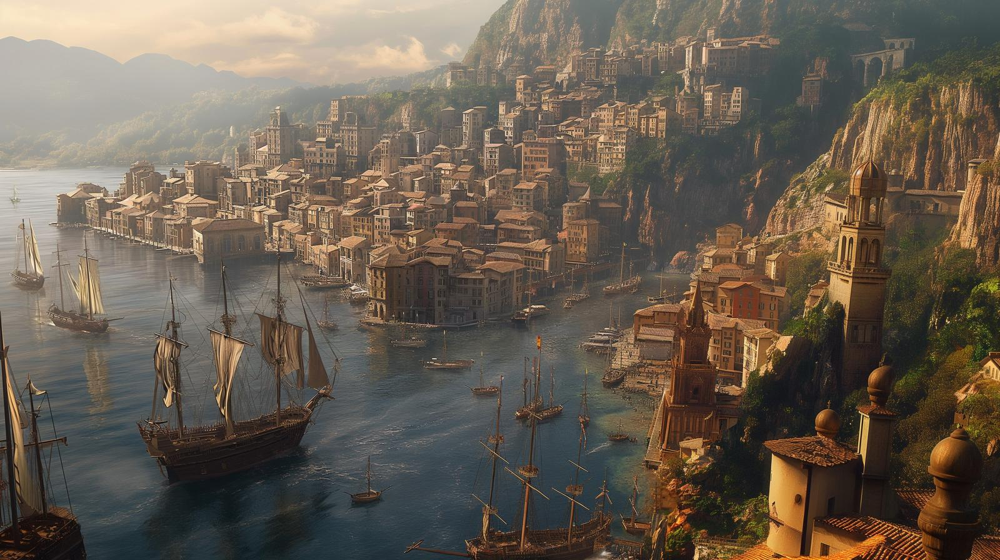

# Castrella
:speaker:{ .middle } *(kah-STREL-ah)*  

-    :octicons-location-24:{ .lg .middle } A city in [Cedrano](<./cedrano.md>), [Chardonian Empire](<../chardonian-empire.md>)  
    :octicons-location-24:{ .lg .middle } Located in [Apporia](<./apporia.md>), the West Coast Region  

Castrella is a dramatic city with a rich history, set on Castrella Bay on a narrow strip of flat land just south of the mouth of the Kedron river, backed by steep hills. The coastal land is dominated by the port itself, and a series of constructed breakwaters. Several dramatic waterfalls cascade down the hills to the north. There is a small bit of agriculture south of the city, across the Kedron and in the Kerdon delta area, but the wealth of Castrella derives largely from the sea.

The city is a bustling port, with a thriving docks and market, and is the provincial capital of [Cedrano](<./cedrano.md>). Although now overshadowed by [Chardon](<../chardon/chardon.md>) as a maritime power, Castrella retains some of the energy of its historic past as the major maritime power on the [Gulf of Chardon](<../../gulf-of-chardon.md>) in the years before the Great War. 

The most significant feature of Castrella is the Grand Promenade, a stretch of quays, docks, and wharfs that runs from the Kedron north for over a mile. At the southern end, near the Kedron, this is a bustling port, with sailor's taverns, warehouses, and constant activity. Further north, the Grand Promenade passes the central market of Castrella, and then reaches the elaborate houses of rich merchants at the northern end. 