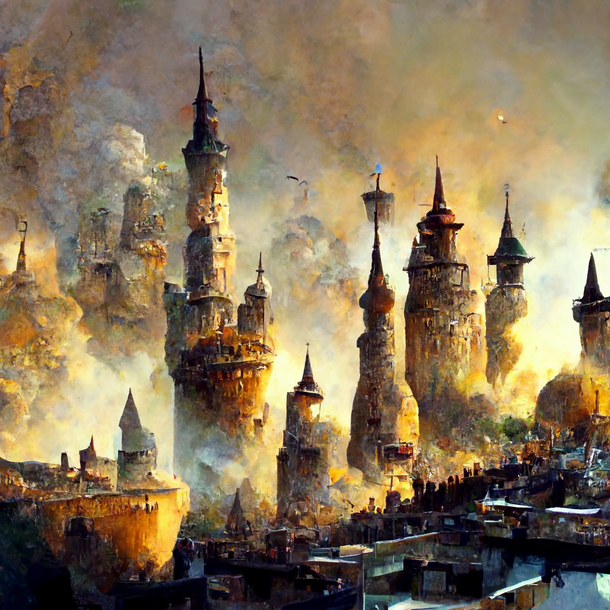

# Chardon

-    :octicons-location-24:{ .lg .middle } A city in the [Chardonian Empire](<../chardonian-empire.md>), [Greater Chardon](<../../greater-chardon.md>)  

Chardon is a city of many things. It is the bustling capitol and seat of government of the [Chardonian Empire](<../chardonian-empire.md>). It is a major center of learning and magic, host to the scholars, wizards, and academics of the [Great Library](<./great-library.md>) and the [University of Chardon](<./university-of-chardon.md>). It is a trade hub and economic powerhouse, known primarily as the only source of processed chalyte, but also as a city of artisans, producing clocks, optics, fine weaponry, scrolls, and other high value goods, and more recently as a major shipbuilder. 

Founded as a small outpost of the [Drankorian Empire](<../../../../history/drankorian-era/drankorian-empire.md>) more than 1000 years ago, over the course of its long history Chardon has grown from a backwater to among the most powerful and cosmopolitan cities of the known world, home to more than 500,000 people. Like [Drankor](<../../../../history/drankorian-era/drankor.md>) before it, Chardon is a city full of professional associations, scholarly societies, private clubs, and collegia, some more secret than others. Most well known are the magical organizations: the secretive Hetaeri Magica, the scholarly [Society of the Open Scroll](<../../../../groups/chardonian-organizations/society-of-the-open-scroll.md>), and the famous faculty of the [University of Chardon](<./university-of-chardon.md>). But numerous smaller societies form the fabric of social life in Chardon. 

## Description

{align="right"; width="400"}As the coastal fog lifts, the first thing you see is the great black bulk of [Mount Nera](<./mount-nera.md>) looming over the city to the north, the occasional glint of light highlighting the obsidian flows that dot the distant slopes of this long extinct volcano. A spur of [Mount Nera](<./mount-nera.md>) cuts south towards the [Chasa River](<../../../major-rivers/chasa-nahadi-watershed/chasa.md>), which spreads into a wide estuary and fertile floodplain towards the coast to the west. 

The bustle of the busy port on the [South Bank](<./south-bank.md>) dominates the soundscape of the city - the cries of sailors, the crack and snap of rigging and sails being set, the creak of ships sailing on the morning tide. Downriver of the mercantile wharves rises the Arsenal’s inner mole, sealing off a separate naval basin whose slipways are hidden from prying eyes..

On the [North Bank](<./north-bank.md>) of the river, in the shadow of [Mount Nera](<./mount-nera.md>), weirs and waterworks are mixed with numerous short, squat buildings of black stone, emitting an acrid stench. These are the chalyte refineries, the source of much of Chardon's wealth, the buildings where the dirty and dangerous work of turning the raw chalyte ore shipped from the north into precious fuel for the magical works of the city takes place. Few live by choice amongst the dirt and stench of these refineries, but this doesn't stop the spread of slums along the [North Bank](<./north-bank.md>), filled with those who have no other options, hemmed in by the chalyte works downriver, and the walled estates upriver, beyond the spur of [Mount Nera](<./mount-nera.md>) that shelters the rich from the noise and stink of the refineries. 

The vast arch of the [River Bridge](<./river-bridge-chardon.md>) provides the main route across the [Chasa](<../../../major-rivers/chasa-nahadi-watershed/chasa.md>). Wide enough for four carts to pass abreast, and enchanted to rise as needed to allow ships to pass, steady foot traffic passes under the watchful eyes of the Praecanti Vigiles - traders, chalyte dealers, wizards and scholars, farmers with goods for market, and many more. Upriver, the [Chardon Bridge](<./chardon-bridge.md>) is used more by locals, farmers as well as the rich and powerful. Smaller, series of twelve arches, this bridge marks the height of navigation for tall-masted sailing ships, although riverboat traffic is frequent here.

The [South Bank](<./south-bank.md>), where the bulk of the city lies, is dominated by the hundreds of towers of Chardon, concentrated in the south and east of the city, where the Great Library stands. But many other sights and spread across the city: the three great markets and dozens of smaller markets, the Imperial Palace, the Cathedral of the Eight, The Pillar of Victory, Haldir's Tomb, the Hospital of the Mother's Grace, as well as other churches, monuments, and palaces scattered across the skyline.

## History

Chardon has grown by alternating periods of slow accretion and swift expansion. As one of the only major cities on the west coast that has never been conquered, Chardon has long been a beacon of safety during times of war and chaos.

### Founding

Conventionally, Chardonian scholars date the beginning of the city of Chardon to the construction of a small Drankorian fortress on the spur of [Mount Nera](<./mount-nera.md>) in DR 609, during the Drankorian Western Wars, although given the protected harbor, rich natural resources, and easy climate, it is very likely that settlement in the area long predates the coming of the [Drankorian Empire](<../../../../history/drankorian-era/drankorian-empire.md>). Over the next 450 years, Chardon grew slowly, primarily through the influx of scholars and wizards curious about the secrets that [Mount Nera](<./mount-nera.md>) might hide. 

- 609 DR: Fort Chardon, on the [Chasa River](<../../../major-rivers/chasa-nahadi-watershed/chasa.md>), is constructed by [Drankorian](<../../../../history/drankorian-era/drankorian-empire.md>) armies to protect a sheltered harbor. 
- 644 DR: Chardon reaches a population of 1000 people, as a small settlement grows in the shadow of [Mount Nera](<./mount-nera.md>), primarily serving as a local market town and safe harbor along the [Chasa](<../../../major-rivers/chasa-nahadi-watershed/chasa.md>).
- 688 DR: The [Great Library](<./great-library.md>) is founded on the south bank of the [Chasa](<../../../major-rivers/chasa-nahadi-watershed/chasa.md>) by the Sibylinites.
- 732 DR: Chardon reaches a population of 2000 people as an influx of scholars and wizards drawn to the [Great Library](<./great-library.md>) settle on the south bank. 
- 844 DR: With the population swelling, the [Chardon Bridge](<./chardon-bridge.md>) is constructed with Drankorian magic to link the growing academic and magical community to the port and military fortifications on the north bank. 
- 939 DR: The [University of Chardon](<./university-of-chardon.md>) is founded; the population of Chardon reaches 5000 people. The first stone walls are constructed, enclosing what is now [Precinct IV](<./precinct-iv.md>). 

### Refuge from the Fall

The Fall of Drankor marked a major turning point in the history of Chardon. Many fleeing the destruction of the heartland of the [Drankorian Empire](<../../../../history/drankorian-era/drankorian-empire.md>), and especially many wizards and scholars, fled west and settled in Chardon. Though the major economic engine of the post-fall years was the growing mercantile empires to the west (in [Apporia](<../apporia/apporia.md>)) and the north (on the [Mawakel Peninsula](<../../../northwest-coast/mawar-confederacy/mawakel-peninsula.md>)), Chardon became a major center of learning and a convenient safe harbor through which the goods of the [Chasa River Valley](<../chasa-river-valley/chasa-river-valley.md>) flowed during these years. 

- 1059 DR: Large numbers of refugees fleeing the [First Plague](<../../../../events/1000s/1059/first-plague.md>) settle in Chardon, swelling the population to 20,000, with more arriving every year. The first timber wharves on the [South Bank](<./south-bank.md>) are constructed. A wooden palisade is constructed to protect the rapidly growing population, enclosing much of what is now Precinct III, V, and VI. The defensive fortifications on the north bank are expanded. 
- 1072 DR: The population of Chardon reaches 40,000 people. The wooden palisade is expanded and replaced with a stone wall. 
- 1099 DR: The population of Chardon reaches 60,000 people. Many wooden wharves on the south bank are replaced and rebuilt with stone. Chardon is becoming a major market where grain from the fertile [Chasa River Valley](<../chasa-river-valley/chasa-river-valley.md>) is traded with merchants from the growing naval power of [Cedrano](<../apporia/cedrano.md>). 

### Growth of Industry

Starting in the DR 1200s, the industrial might of Chardon begins to grow. It is during this era that the [River Bridge](<./river-bridge-chardon.md>) is built, the paper mills become established on the [North Bank](<./north-bank.md>), and Chardon becomes known not just as a center of magical learning but a place of skilled craft as well. 

- 1324 DR: The population of Chardon reaches 100,000. The walls are expanded and reconstructed, forming the current old city walls, enclosing Precincts I - VI. 
- 1366 DR: The growing paper industry on the [North Bank](<./north-bank.md>) necessitates extensive water works. The [Mill Channel](<./mill-channel.md>) is constructed. 
- 1374 DR: The [River Bridge](<./river-bridge-chardon.md>) is constructed to relieve traffic on river crossings. 

### The Great War and the Blood Years

During the years before the [Great War](<../../../../events/1500s/great-war.md>), Chardon was a major city, primarily known for the renown of its wizards. It emerged from the [Great War](<../../../../events/1500s/great-war.md>) as the last bastion of safety on the west coast, despite nearly falling during the Conclave War. During the years that followed, the population of Chardon swelled with refugees, the massive outer walls of the city were constructed, and the northern wall was built. 

### Imperial Capital 

Chardon emerged from the War of the Dark Rift as the capital city of a small, and growing, empire, and the most significant maritime power on the west coast. During the years that followed, the economic might of Chardon grew dramatically, especially after the discovery of chalyte in the north in the late 1600s. 

## Urban Geography

Chardon is organized into 21 administrative precincts, as well as a number of unincorporated suburbs south of the city. 

Precincts I - VII are the inner core of the original Drankorian city, and are enclosed by the walls constructed during the expansion of the city in the 1300s. The modern port is largely congruent with [Precinct VI](<./precinct-vi.md>); the university district is Precinct IV; the imperial administrative center is in Precinct I. 

Precincts VIII - XVI form the outer core of the [South Bank](<./south-bank.md>), numbered from VIII in the southwest to XVI in the northeast. Precinct VIII is adjacent to the naval arsenal; Precinct X houses the massive Kylos Market.

Precincts XVII - XXI are on the [North Bank](<./north-bank.md>); while Precincts XVIII and XIX are inside the north walls, XVII, XX, and XXI are the administrative units for the northern suburbs, with XVII containing the largest part of the chalyte refineries and the slums of the [Riverside Quarter](<./riverside-quarter.md>). 

To the south of the city, extensive suburban development is not incorporated into the adminstrative precincts, and instead represents a patchwork of arrangements. 

East of Mount Nera on the north bank, the [Nera Domains](<./nera-domains.md>) are a collection of private estates and lordly manors of the rich and powerful. 

## Trade and Economy

## Government 

## Key Organizations

