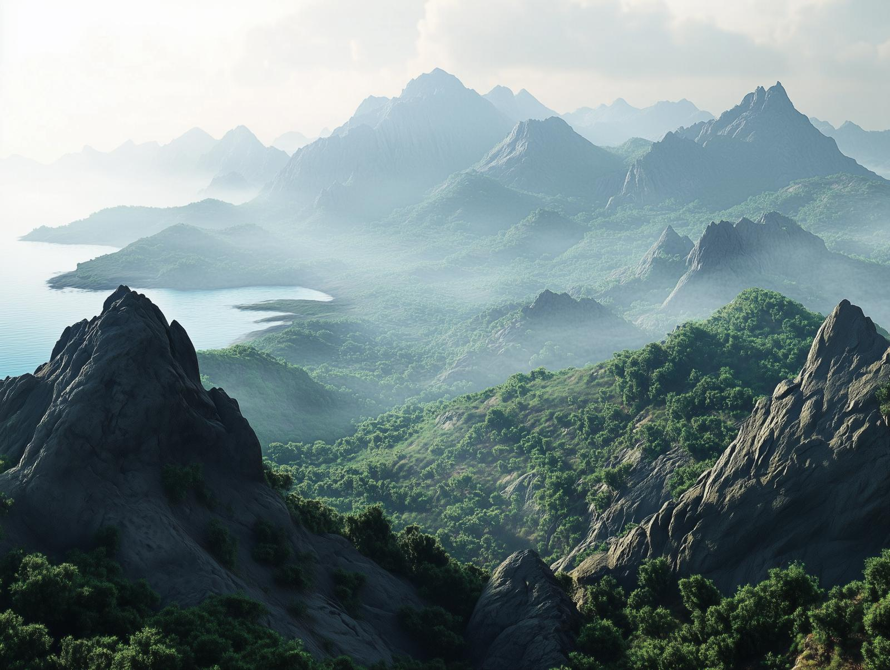

# The Chataan Mountains
:speaker:{ .middle } *(cha-TAWN)*  

-    :octicons-location-24:{ .lg .middle } A mountain range in [Greater Chardon](<./greater-chardon.md>)  

The Chataans are a rugged, rocky mountain chain that rise from the hills and cliffs on the northeast shore of the [Nevos Sea](<../nevos-and-apporia/nevos-sea.md>), to a height of land at nearly 10,000 feet, blending lush forests with steep, exposed rock faces. Monsoonal rains create seasonal streams and waterfalls along the slopes, nourishing dense woodlands of teak and pine in sheltered valleys, that turn golden in the dry season. 

To the northeast, the Chataans merge with the rugged hills of the [Myraeni Gap](<../greater-dunmar/myraeni-gap.md>); to the southeast, across the ~Yuvanti Gap~, is the imposing bulk of the [Yuvanti Mountains](<../greater-dunmar/yuvanti-mountains.md>).

