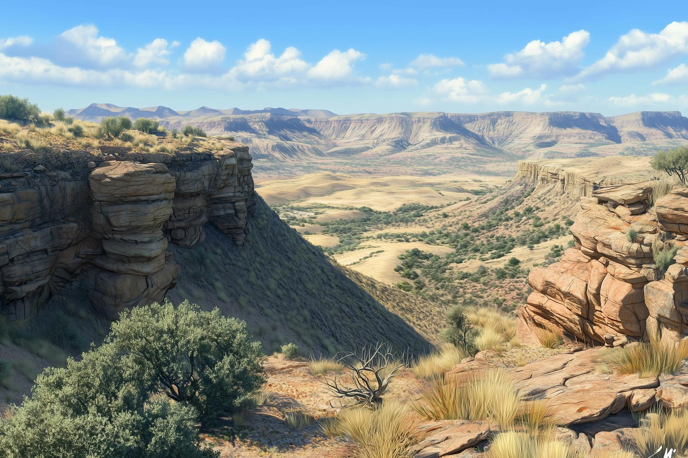

# The Copper Hills

-    :octicons-location-24:{ .lg .middle } A line of hills in [Central Dunmar](<../realms/dunmar/central-dunmar/central-dunmar.md>), [Dunmar](<../realms/dunmar/dunmar.md>), [Greater Dunmar](<../greater-dunmar.md>)  

{align="right"; width="450"}The Copper Hills are a rugged, arid region of dry valleys and rocky, sun-baked slopes rising gently from the plains, between [Tokra](<../realms/dunmar/central-dunmar/tokra/tokra.md>) and [Darba](<../realms/dunmar/coastal-dunmar/darba/darba.md>). Sparse vegetation clings to the hillsides, with hardy desert grasses and low, twisted trees sheltered in shaded ravines. Intense monsoonal rains briefly turn dusty riverbeds into muddy torrents, bringing a short-lived burst of green and wildflowers to the hills before the land fades back to browns and grays. This area was once famous for copper mining, but is largely abandoned now. 

While several seasonal and intermittent rivers flow north from the Copper Hills, the only perennial river with the Copper Hills as its source is the [Sukal](<../rivers/hara-watershed/sukal.md>), which flows east to its confluence with the [Hara](<../rivers/hara-watershed/hara.md>). 
