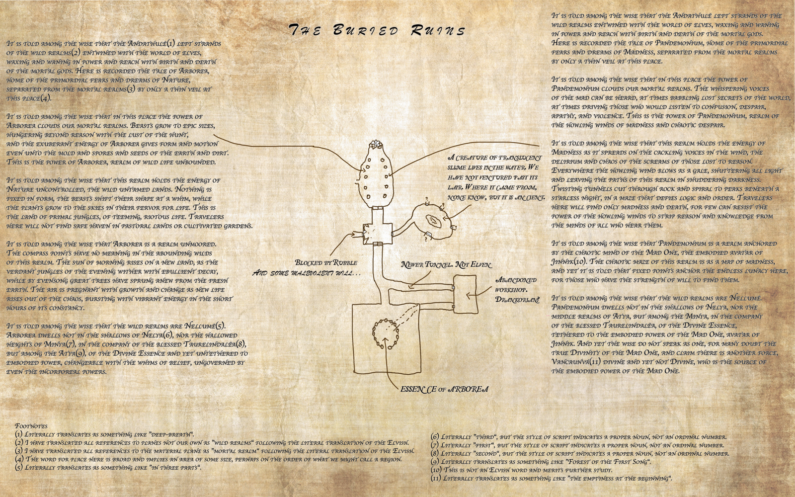

# The Ruined Elven Workshop (near Tokra)
>[!info]+ Information
> A  ruin in the [Lakan Monastery](<../realms/dunmar/central-dunmar/tokra/lakan-monastery.md>), [Tokra](<../realms/dunmar/central-dunmar/tokra/tokra.md>), [Central Dunmar](<../realms/dunmar/central-dunmar/central-dunmar.md>), [Dunmar](<../realms/dunmar/dunmar.md>)

%

Under the [Lakan Monastery](<../realms/dunmar/central-dunmar/tokra/lakan-monastery.md>) is the ruins of an ancient elven workshop, which is located on a weak point where the energy of [Arborea](<../../../cosmology/multiverse/spiritual-realms/primal-realms/arborea.md>) leaks into the material plane. 

Kassi's map of the ruins:

## History
Thousands of years ago, when [Dunmar](<../realms/dunmar/dunmar.md>) was a great elven forest, there was a low hill where the [Lakan Monastery](<../realms/dunmar/central-dunmar/tokra/lakan-monastery.md>) is now, and at the center of the hill was a place where the connection to the outer plane of [Arborea](<../../../cosmology/multiverse/spiritual-realms/primal-realms/arborea.md>), a place of wild, uncontrolled nature, was particularly strong.

The elves dug a cave system to protect and study this place, tending the strange creatures that would spring from the planar weakness, and guarding the outside world from the unrestrained influence of [Arborea](<../../../cosmology/multiverse/spiritual-realms/primal-realms/arborea.md>).

When the elven kingdom fell, this place fell into ruin, and was lost, the entrance collapsed.

- 1194 DR The Lakan monastery is founded on a small hill, south of Tokra and on top of a long-ruined elven workshop associated with an [extraplanar weak point](<../../../cosmology/multiverse/extraplanar-weak-point.md>) connecting to the plane of [Arborea](<../../../cosmology/multiverse/spiritual-realms/primal-realms/arborea.md>)
- 1387 DR Lakan monks excavate the elven cave system underneath their monastery, and discover the [extraplanar weak point](<../../../cosmology/multiverse/extraplanar-weak-point.md>)

