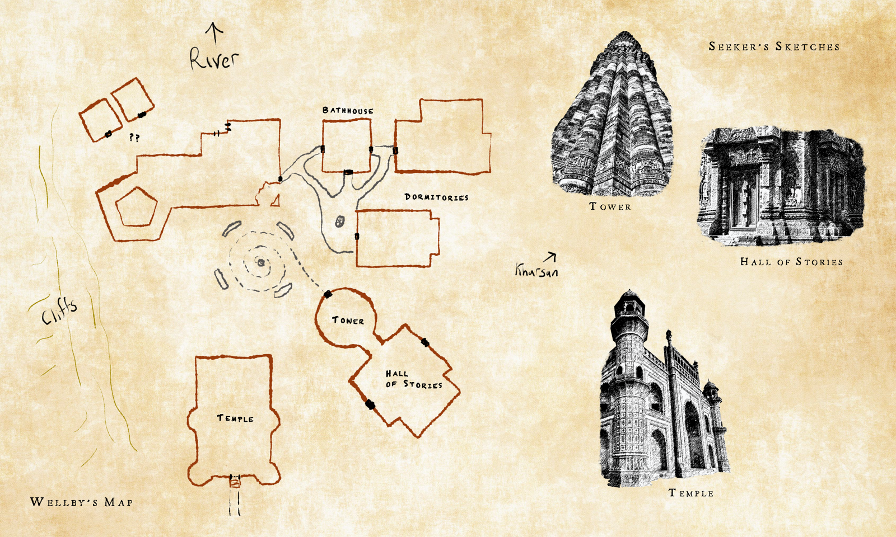

# The Monastery of Bhishma

-    :octicons-location-24:{ .lg .middle }   

## Overview
The Monastery of [Bhishma](<../../../cosmology/gods/incorporeal-gods/dunmari/bhishma.md>) is a large complex dedicated to the Dunmari goddess [Bhishma](<../../../cosmology/gods/incorporeal-gods/dunmari/bhishma.md>), consisting of a temple, dormitories and associated buildings, and the [Hall of Stories](<./hall-of-stories.md>), an archive of the stories and lives of the Dunmari people. 

The monastery is about 2 1/2 miles south of [Kharsan](<./kharsan.md>), in what was once the heartland of [Dunmar](<../realms/dunmar/dunmar.md>) but is now, after the upheavals of the [Great War](<../../../events/1500s/great-war.md>) and the [Blood Years](<../../../events/1500s/blood-years.md>), the midst of the [Nashtkar](<./nashtkar.md>), the blasted plains. The monastery sits on a bluff near a turn in the [Kharja](<../../istaros-watershed/rivers/kharja.md>) river, once a lush riparian valley before the [Great War](<../../../events/1500s/great-war.md>), with the river forming the southern and western borders of the complex. The southern side consists of steep cliffs, while the western side gently slopes to the river, and was formerly the site of a thriving garden. There is a newer path with a few stone steps that has been constructed from the dry river bed up the slope, and the remains of stairs cut into the side of the cliff. 

Because of the slope of the land, the temple is the most prominent building from any direction, with the tower attached to the [Hall of Stories](<./hall-of-stories.md>) also notable. The one story cloisters and kitchens, and the baths and workshops sit low and are less notable architecturally. The two dormitories, with space for several hundred monks in residence, are elegant three story buildings, though not as prominent as the temple or the [Hall of Stories](<./hall-of-stories.md>). 

The monastery served as the headquarters of the Bhishma Mystai, also known as the [Order of the Awakened Soul](<../../../groups/dunmari-mystery-cults/order-of-the-awakened-soul.md>), since its founding. In its heyday, the Monastery was noted for the quality of the paper produced, especially the magical papers and inks required to produce spell scrolls and other magical writing.

## Events

In 1748, [Dunmar Fellowship](<../../../people/pcs/dunmar-fellowship/dunmar-fellowship.md>) came to the monastery, seeking to learn more about the history of the [Order of the Awakened Soul](<../../../groups/dunmari-mystery-cults/order-of-the-awakened-soul.md>), among other things. While there, [Seeker](<../../../people/pcs/dunmar-fellowship/seeker.md>) documented the buildings, and [Wellby](<../../../people/pcs/dunmar-fellowship/wellby.md>) mapped the complex. Their notes are reproduced below:

