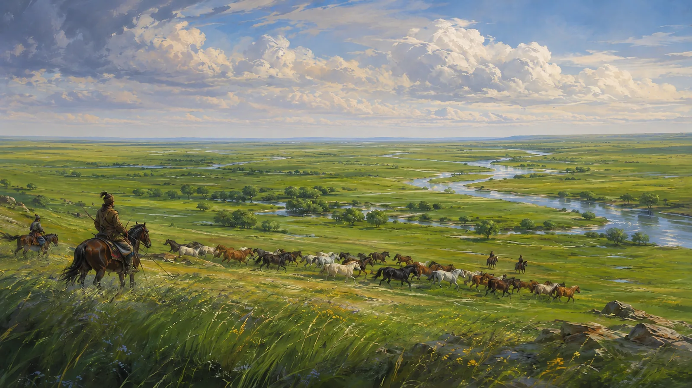
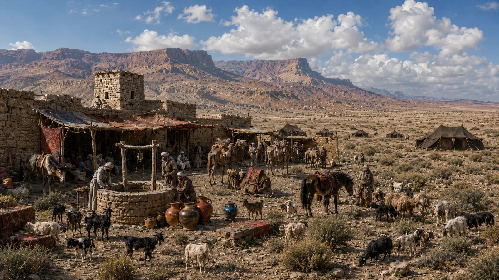

# The Hara Basin

-    :octicons-location-24:{ .lg .middle } A region in [Greater Dunmar](<../greater-dunmar.md>)  

The Hara Basin is a broad, flat, semi‑arid lowland that contains the riverine heartland of [Central Dunmar](<../realms/dunmar/central-dunmar/central-dunmar.md>), as well as the eastern deserts that grade up toward the [Garamjala Plateau](<../../drankorian-hinterland/garamjala-plateau/garamjala-plateau.md>). This region is marked by stark, contrasting seasons: hot, dry winters and springs yield to short, intense summer monsoons that green the plains and swell the rivers.

## Boundaries & Topography
The basin is bounded to the west and southwest by the rain‑shadowed front of the [Yuvanti Mountains](<../yuvanti-mountains.md>), to the north by the foothills of the [Sentinel Range](<../../sentinel-range.md>), to the east by the high deserts of the [Garamjala Plateau](<../../drankorian-hinterland/garamjala-plateau/garamjala-plateau.md>), and to the northwest by the [Myraeni Gap](<../myraeni-gap.md>). Its northwest quarter, the [~Songara Plains~](<songara-plains.md>) is the most fertile, supporting year-round open grassland; the center spreads into a broad alluvial plain along the [Hara](<../rivers/hara-watershed/hara.md>); the southeast grades to arid scrub and then the [~Karawa Desert~](<karawa-desert.md>). 

## Hydrology
The [Hara](<../rivers/hara-watershed/hara.md>) is the principal river of the region, exiting the basin through the [~Hara River Gorge~](<hara-river-gorge.md>) roughly two hundred miles southeast of [Askandi](<../realms/dunmar/central-dunmar/askandi.md>). From the north and northwest it gathers the [Sone](<../rivers/hara-watershed/sone.md>)—a snowmelt river from the [Sentinels](<../../sentinel-range.md>) and the [Chataan Mountains](<../../greater-chardon/chataan-mountains.md>) that crosses the [~Songara Plains~](<songara-plains.md>)—and the [Thandar](<../rivers/hara-watershed/thandar.md>), both joining the Hara north of [Tokra](<../realms/dunmar/central-dunmar/tokra/tokra.md>). From the west, the seasonal [Sukal](<../rivers/hara-watershed/sukal.md>) joins the [Hara](<../rivers/hara-watershed/hara.md>) south of [Tokra](<../realms/dunmar/central-dunmar/tokra/tokra.md>), flowing from its sources in the [Copper Hills](<../darba-highlands/copper-hills.md>). 

## Climate
Monsoon‑driven rains fall primarily June–October, strongest in the west and north. The southern and eastern basin lies in deep rain shadow, with patchy or unreliable precipitation. Short green seasons alternate with long, dusty months.

## Subregions
{align="right"; width="600"}In the northwest, the [~Songara Plains~](<songara-plains.md>) extend in a broad arc from the [Chataan Mountains](<../../greater-chardon/chataan-mountains.md>) to [Songara](<../realms/dunmar/central-dunmar/songara.md>) to the upper reaches of the [Hara](<../rivers/hara-watershed/hara.md>). These plains are wetter and support a more consistent grassland, with vast herds of horses that the Dunmari are famous for. This terrain once extended across much of central and eastern Dunmar, until the upheavals at the end of the Great War. The [Sone](<../rivers/hara-watershed/sone.md>), fed by snowmelt in the Sentinels and the [Chataan Mountains](<../../greater-chardon/chataan-mountains.md>), flows northeast through the [~Songara Plains~](<songara-plains.md>), until it joins the [Hara](<../rivers/hara-watershed/hara.md>) north of [Tokra](<../realms/dunmar/central-dunmar/tokra/tokra.md>).

The center of the Hara Basin is a region of varied terrain and climate. North of Tokra, the [~North Tokra Plains~](<north-tokra-plains.md>) occupy a broad swath on both sides of the [Hara](<../rivers/hara-watershed/hara.md>), just south of the confluence with [Thandar](<../rivers/hara-watershed/thandar.md>). This region is not as wet as the [~Songara Plains~](<songara-plains.md>): nearly all the rain that falls here falls between June and October, during the monsoon season. 

South of Tokra, the terrain gets increasing rugged and arid. The [~Southern Tokra Plains~](<southern-tokra-plains.md>), more directly in the rain shadow of the [Yuvanti Mountains](<../yuvanti-mountains.md>), get inconsistent rain, even during the monsoon, and the terrain beings to transition from a grassland to arid scrub. Around [Askandi](<../realms/dunmar/central-dunmar/askandi.md>), the terrain becomes drier still. Caught between the high peaks of the Yuvanti in the west and the rising terrain of the [Garamjala Plateau](<../../drankorian-hinterland/garamjala-plateau/garamjala-plateau.md>)to the east, the [~Lower Hara Valley~](<lower-hara-valley.md>) sees little rain and what vegetation there is is entirely reliant on the water of the [Hara](<../rivers/hara-watershed/hara.md>) itself. Approximately 200 miles southeast of [Askandi](<../realms/dunmar/central-dunmar/askandi.md>), the [Hara](<../rivers/hara-watershed/hara.md>) exits the basin through the [~Hara River Gorge~](<hara-river-gorge.md>).

{align="left"; width="600"}In the east, the land gets increasing arid. What rain that does fall tends to fall in the foothills of the Sentinels, on the [Samtal](<samtal.md>), where spring snowmelt and the occasionally summer storm supports seasonal grasslands, which provide grazing for hardy sheep and goats. South of the plains, the land around [Karawa](<../realms/dunmar/eastern-dunmar/karawa.md>) is an arid desert. The [~Karawa Desert~](<karawa-desert.md>), on the eastern edge of the Dunmari Basin, does get the occasional summer storm during the monsoon, but largely lacks water resources beyond underground oasis and aquifers. Once, the [Kharja](<../kharja.md>) river provided a rich riparian habitat in this area, but now it no longer reliably flows, except during rare summer storms. East of the [Kharja](<../kharja.md>) riverbed, the Dunmari Basin ends in the rising deserts of the [Garamjala Plateau](<../../drankorian-hinterland/garamjala-plateau/garamjala-plateau.md>).

## Settlements
Most people of the basin are nomadic or transhumant herders who move with grass and water. Permanent agriculture is uncommon outside a few permanent settlements, where reliable irrigation from the [Hara](<../rivers/hara-watershed/hara.md>) allows crops to grow. 

The most notable permanent settlement is the ancient city of [Tokra](<../realms/dunmar/central-dunmar/tokra/tokra.md>), on a natural rise above the valley floor and just west of the massive Drankorian bridge where the [Stoneway](<../roads/stoneway.md>) crosses the [Hara](<../rivers/hara-watershed/hara.md>). Farther downstream, [Askandi](<../realms/dunmar/central-dunmar/askandi.md>) serves as a river town and trade center for the lower valley and the dwarves of [Nardith](<../realms/nardith/nardith.md>) in the mountains to the southwest. To the east, [Karawa](<../realms/dunmar/eastern-dunmar/karawa.md>) marks the edge of the basin where desert grazing begins and travel turns to oases and wells.

Throughout the basin, encampments and caravanserai mark a day’s travel along the main routes. Temples host seasonal gatherings when the [Dunmari](<../realms/dunmar/dunmar.md>) gather to trade, seek judgments, and celebrate festivals. 