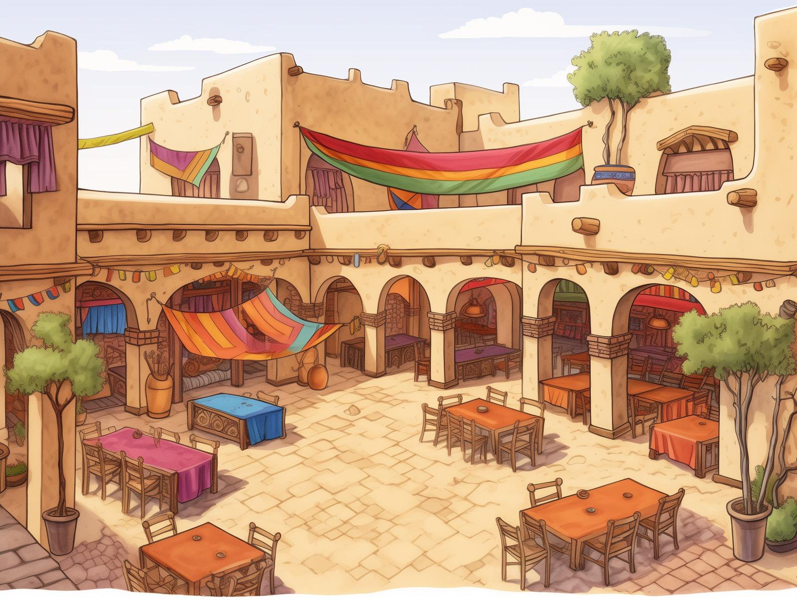

# Ikram's

-    :octicons-location-24:{ .lg .middle } A [Dunmari](<../dunmar.md>) caravanserai [Karawa](<./karawa.md>)  

A large caravanserai, inn, and trading post in [Karawa](<./karawa.md>). It is on the northern outskirts of the village, a large square building with an open courtyard, rooms for travelers, and space for merchants and animals. This is a center of commence in the village when the market is deserted, and many things can be acquired from [Ikram](<../../../../../people/dunmari/ikram.md>), the proprietor. 

## Food and Drink

Popular menu items include:
- Sweet, chilled date wine
- Sharba, a popular Dunmari vodka-style drink fermented from milk
- Spiced beer, sometimes available, as it is imported from [Nardith](<../../nardith/nardith.md>)
- Grilled meat and kebabs, usually goat or sheep
- Quick breads

## Events

- Apr 12, 1748 DR*([Karawa](<./karawa.md>)):* [Ikram's caravanseri](<./ikrams.md>) is destroyed when gnolls set fire to much of the village. 
- Jun 02, 1748 DR *([Karawa](<./karawa.md>)):* [Ikram](<../../../../../people/dunmari/ikram.md>) begins rebuilding a new, better fortified [caravanserai](<./ikrams.md>)
- Jan 11, 1749 DR *([Karawa](<./karawa.md>)):* The new [Ikram’s](<./ikrams.md>) is completed