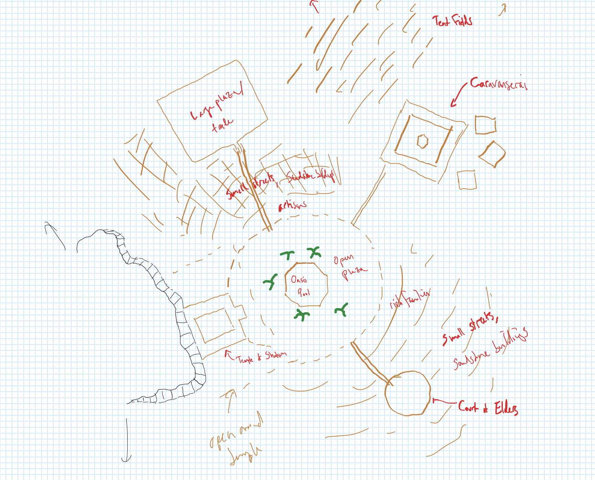

# Karawa

-    :octicons-location-24:{ .lg .middle } A town in [Eastern Dunmar](<./eastern-dunmar.md>), [Dunmar](<../dunmar.md>), [Greater Dunmar](<../../../greater-dunmar.md>)  

A small Dunmari village. Houses of adobe / mud brick, except a few bigger or more important ones of sandstone. Colors browns and some ochre. Lots of awnings of variously colored cloth, lots of horses and goats. Much of the town was destroyed in gnoll attacks in the summer of 1748, but is in the process of being rebuilt. 
#### Locations

[Temple of Shakun](<./temple-of-shakun.md>): one of the few buildings not destroyed during the gnoll attacks; set into the mesa itself.

[Red Mesa](<./red-mesa.md>): a massive red stone flat-topped mesa that looms over the village. 

[The caravanserai](<./ikrams.md>): Largely destroyed in the gnoll attacks. A new caravanserai is under construction, larger and better fortified. 

The Oasis: The central feature of the town is a small oasis. Over the years a marble pool and short wall has been built around it, allowing water to be drawn off for various uses. The reliability and purity of the water here has established Karawa as a waypoint and gathering place for the Dunmari. Palm trees provide shade and shelter and make the oasis square a place where people linger. Fouled by gnolls, but now clear again. There has always been a holy spring here, a place that people said could show you glimpses of dreams and faraway visions of possible futures, guarded and protected by a small Mystery Cult dedicated to [Shakun](<../../../../../gods-and-religions/gods/incorporeal-gods/dunmari-pantheon/shakun.md>).

The market square: On the northwestern edge of town, there is a large market square, which stands empty most of the year, filling to capacity only during the large markets after the [Festival of Rebirth](<../../../../../gods-and-religions/holidays-and-festivals/dunmari-festivals/festival-of-rebirth.md>), at least this is what you've been told. Beyond it, cleared scrublands and pastures serve as a temporary home for hundreds of herders who return for the [Festival of Rebirth](<../../../../../gods-and-religions/holidays-and-festivals/dunmari-festivals/festival-of-rebirth.md>), or so you've heard.

The Temple of [Five Siblings](<../../../../../gods-and-religions/religions/five-siblings/five-siblings.md>): Although the [Temple of Shakun](<./temple-of-shakun.md>) is the larger draw in Karawa, a small temple to [Five Siblings](<../../../../../gods-and-religions/religions/five-siblings/five-siblings.md>) stands on the eastern side of town, facing a small public square. The temple itself is plain, but well-maintained. Damaged, but not destroyed, in the gnoll attacks, and has been rebuilt. 

The Council of Elders: Standing across a small public square from the Temple of [Five Siblings](<../../../../../gods-and-religions/religions/five-siblings/five-siblings.md>) is a circular, dome shaped building that is the main public building in Karawa. This space serves as the council chambers where the council of elders meets to deliberate, and the square in front is a place for public debate. Judgements are issued here by the council.

The village: The village itself is mostly small houses of adobe and mud, facing on narrow streets, with shade provided by colorful awnings. A few artisans and scattered shops line the streets facing the caravanserai, including a tea house which [Delwath](<../../../../../people/pcs/dunmar-fellowship/delwath.md>) once lived above, and a blacksmith. Most of the small houses were burned and destroyed in the gnoll attacks, but many have been cleaned and are being rebuilt. 

The fields: To the southeast of town, some small scale agriculture provides a bit of extra food, beyond what the herds can provide and what can be traded with pastoralists passing through. Crops that require little water and lots of heat do best, although the oasis feeds irrigation channels here that allows crops to thrive. Dates and honey are a particular delicacy, being used to make wine and desserts.

