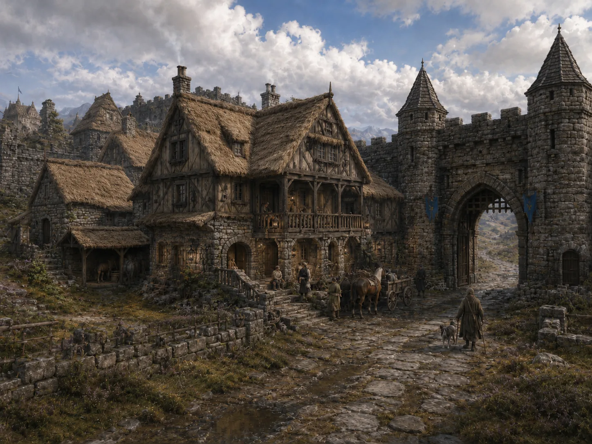

# The Traveler's Rest

-    :octicons-location-24:{ .lg .middle } An inn in [Roscombe](<roscombe.md>), [Carlinshire](<carlinshire.md>), [Addermarch](<addermarch.md>), [Greater Sembara](<../greater-sembara.md>)  

The Traveler’s Rest is Roscombe’s principal inn, a sturdy two‑storey house set against the southern wall, near the gate and the road to [Valcroix](<valcroix.md>). It offers clean beds, hot meals, and reliable stabling for the occasional travelers from river valleys around the [Velan](<../rivers/wistel-enst-watershed/velan.md>) and the [Umber](<../rivers/wistel-enst-watershed/umber.md>), including several rooms on the ground floor reserved for halflings.

Run by [Bertrand LeBlanc](<../../../people/addermarians/bertrand-leblanc.md>), an affable, efficient host, the inn has a reputation for fair dealing and a well‑kept cellar. 

