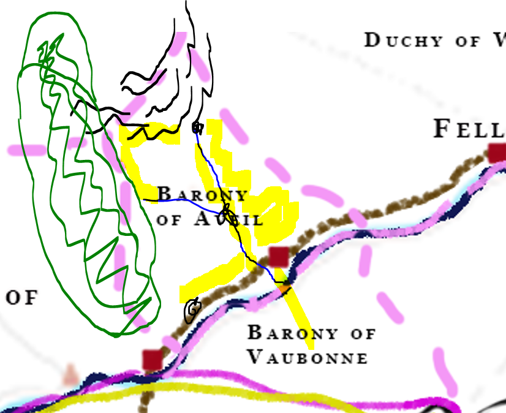

# The Barony of Aveil

-    :octicons-location-24:{ .lg .middle } A barony in [Sembara](<../sembara.md>), the [Western Green Sea Region](<../../../western-green-sea/western-green-sea-region.md>)  

The Barony of Aveil is one of the oldest baronies in Sembara, sitting between the [Western Marches](<../western-marches/western-marches.md>), the powerful [Duchy of Wisford](<../heartlands/duchy-of-wisford.md>), and the sparsely settled [Borderlands](<../borderlands/borderlands.md>). The western third of the barony is dominated by the [Cleenseau Wood](<cleenseau-region/cleenseau-wood.md>), and ancient old-growth forest. In the north, the [Aveil Ridge](<./aveil-ridge.md>), a small escarpment, defines the northern quarter of the barony, and is home to the seat of the baron, [Veltor](<./veltor.md>), a small fortified castle near the headwaters of the [Auberonne](<../../rivers/wistel-enst-watershed/auberonne.md>). Two rivers run through the barony: the [Auberonne](<../../rivers/wistel-enst-watershed/auberonne.md>), which runs the length of the barony, and the [Leandre](<../../rivers/wistel-enst-watershed/leandre.md>) which is smaller and flows from the [Cleenseau Wood](<cleenseau-region/cleenseau-wood.md>) to the [Auberonne](<../../rivers/wistel-enst-watershed/auberonne.md>). 

The borders of the barony are the height of land of the [Aveil Ridge](<./aveil-ridge.md>) in the north, 12 miles from the course of the [Auberonne](<../../rivers/wistel-enst-watershed/auberonne.md>) in the east, the [Enst](<../../rivers/wistel-enst-watershed/enst.md>) in the south, and, for all practical purposes, the eastern edge of the [Cleenseau Wood](<cleenseau-region/cleenseau-wood.md>).

The three largest settlements in the barony are [Rinburg](<./rinburg.md>), a free city on the [Enst](<../../rivers/wistel-enst-watershed/enst.md>), [Cleenseau](<cleenseau-region/cleenseau/cleenseau.md>), an important market town, also on the [Enst](<../../rivers/wistel-enst-watershed/enst.md>), and [Aslain](<./aslain.md>), a market town at the confluence of the [Auberonne](<../../rivers/wistel-enst-watershed/auberonne.md>) and the [Leandre](<../../rivers/wistel-enst-watershed/leandre.md>). 

The barony is characterized by five major regions:

* the [Cleenseau Region](<cleenseau-region/cleenseau-region.md>) in the west is somewhat disconnected from the rest of the barony, there being no settlements for the fifteen miles between [Dallet](<cleenseau-region/dallet.md>) and [Beury](<cleenseau-region/beury.md>)
* [Rinburg](<./rinburg.md>) and its hinterland, a land of sheep herders, small pastoral villages, and fishing villages, all clustered along the [Enst](<../../rivers/wistel-enst-watershed/enst.md>) and the [Great South Road](<../../roads/great-south-road.md>)
* the [Aveil Ridge](<./aveil-ridge.md>) in the north, a escarpment that rises about 800' above the land, the source of the [Auberonne](<../../rivers/wistel-enst-watershed/auberonne.md>) and little-settled hilly land of secondary forest. The seat of the baron, [Veltor](<./veltor.md>), is here
* the [Auberonne](<../../rivers/wistel-enst-watershed/auberonne.md>) valley, the richest farmland of the barony
* the [Cleenseau Wood](<cleenseau-region/cleenseau-wood.md>), and the small villages along its eaves

Most of the settlement in the barony is along the eastern valleys and banks of the [Auberonne](<../../rivers/wistel-enst-watershed/auberonne.md>), where the farmland is better, and the sheep pastures along the [Enst](<../../rivers/wistel-enst-watershed/enst.md>). 

In general, despite its relatively ancient roots, [Aveil](<./barony-of-aveil.md>) is a poor barony largely dominated by the powerful [Duchy of Wisford](<../heartlands/duchy-of-wisford.md>) to its west, save for the [Cleenseau Region](<cleenseau-region/cleenseau-region.md>), which tends to see itself as more independent and if anything, more aligned with the powerful [Army of the West](<../../../../groups/sembaran-army/army-of-the-west.md>). [Rinburg](<./rinburg.md>), at the head of the navigation of the [Enst](<../../rivers/wistel-enst-watershed/enst.md>) is a wealthy and bustling market town, but as a free city, contributes little to the barony itself. Even the better farmland in the eastern [Auberonne](<../../rivers/wistel-enst-watershed/auberonne.md>) valley is not as rich as the heartlands of Sembara, and much of the land was pillaged by hobgoblins during the hobgoblin wars. [Veltor](<./veltor.md>) never fell, and the [Aveil Ridge](<./aveil-ridge.md>), with its many caves, was a redoubt for Sembaran troops resisting the hobgoblins. There are several rich tin mines in the [Aveil Ridge](<./aveil-ridge.md>), but they are controlled by the [Duchy of Wisford](<../heartlands/duchy-of-wisford.md>) and contribute little to the wealth of the barony.

There is a maintained road the length of the [Auberonne](<../../rivers/wistel-enst-watershed/auberonne.md>), from [Rinburg](<./rinburg.md>) to [Veltor](<./veltor.md>), and the Aveil Road which runs north from the tin mines to the [Wistel](<../../rivers/wistel-enst-watershed/wistel.md>).

