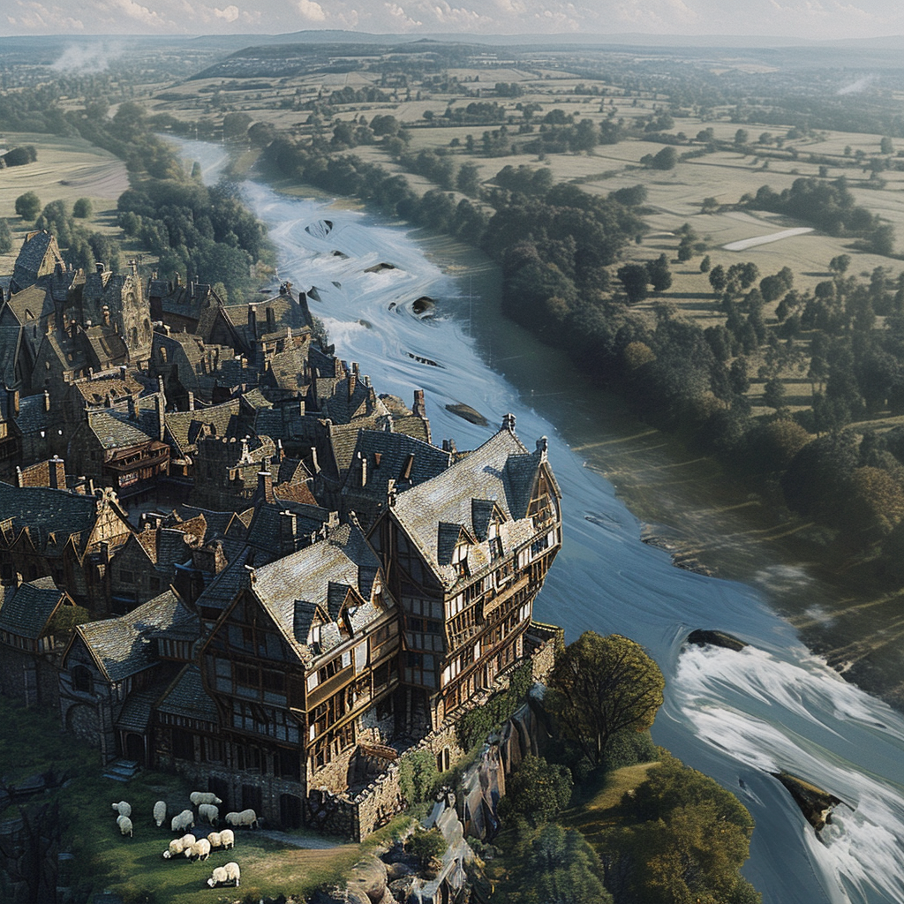

# Champimont
:speaker:{ .middle } *(Sham-PEE-mohn)*  

-  
    :octicons-people-24: pop. 971  
    :octicons-location-24:{ .lg .middle } A market town in the [Barony of Aveil](<./barony-of-aveil.md>), [Sembara](<../sembara.md>), [Greater Sembara](<../../greater-sembara.md>)  

{align="right"; width="400"}Champimont is the largest town between [Cleenseau](<cleenseau-region/cleenseau/cleenseau.md>) and [Rinburg](<./rinburg.md>) and is known for its grand inn, [The Elegant Swan](<./the-elegant-swan.md>). It is a common stopping point for travelers along the road, and has several smaller inns and caravan yards.  There is also a large market once a month that draws people from as far away as [Eftly](<./eftly.md>) and [Dallet](<./dallet.md>) and an array of blacksmiths, carpenters, and other artisans. It set on a bluff above the river, and has neither a ferry nor a bridge. The land on the south bank of the river here is mostly uninhabited, and is a land of rocky soil, scattered forests, and small rocky hills. On the north bank, around Champimont, is farmland and a lot of pasture for sheep. 

The current lord of the Manor of Champimont is Raoul Montagu.

_Distances:_
* to [Rinburg](<./rinburg.md>), 27 miles
* to [Cleenseau](<cleenseau-region/cleenseau/cleenseau.md>), 33 miles
* to [Dallet](<./dallet.md>), 13 miles
* to [Essenmer](<./essenmer.md>), 15 miles