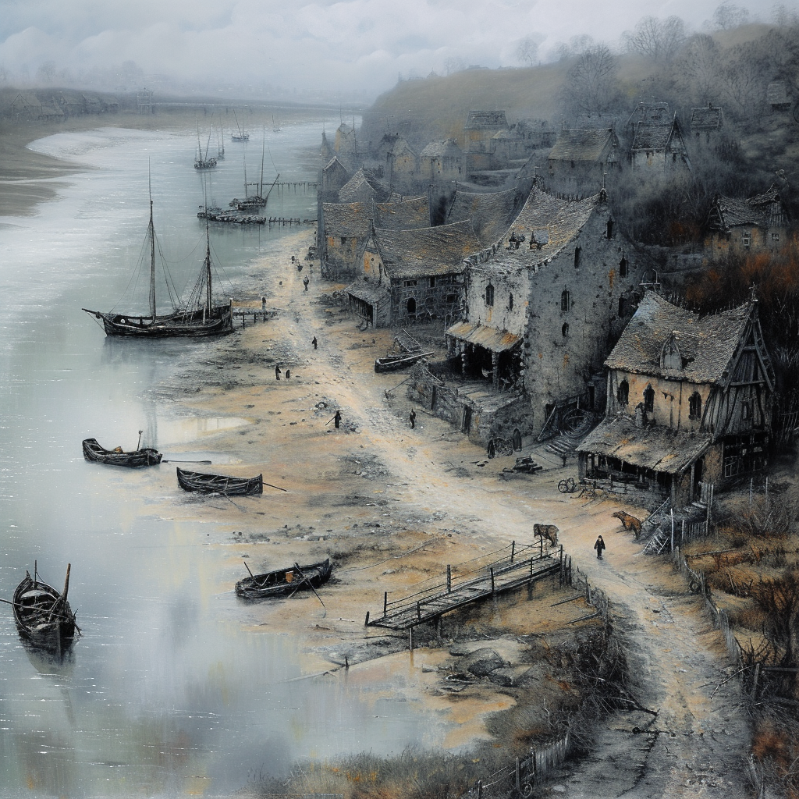
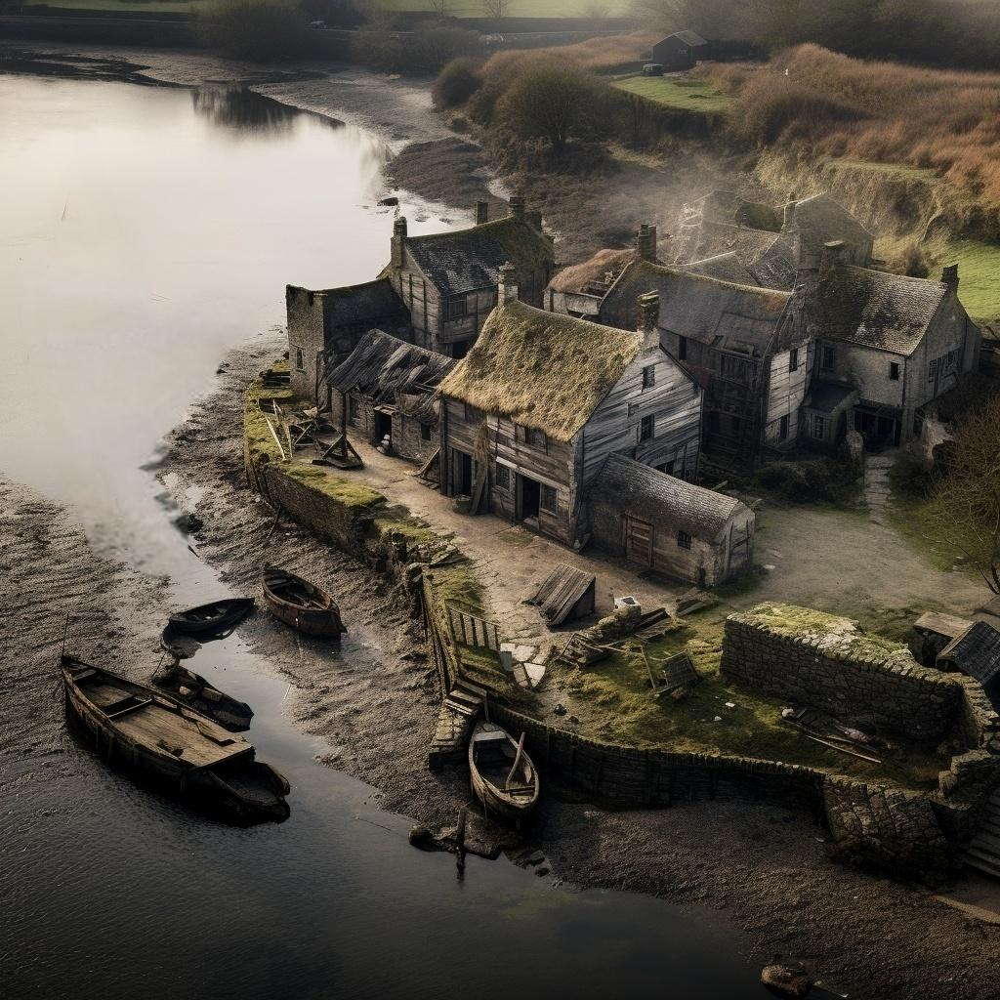

# Asineau
:speaker:{ .middle } *(Ah-zee-noh)*  

-  
    :octicons-people-24: pop. 311  
    :octicons-location-24:{ .lg .middle } A fishing village in the [Manor of Asineau](<./manor-of-asineau.md>), the [Barony of Aveil](<../barony-of-aveil.md>), [Sembara](<../../sembara.md>), [Greater Sembara](<../../../greater-sembara.md>)  

{align="right"; width="320"} {align="right"; width="320"}A manorial fishing village on the banks of the Enst, two miles downriver of [Auloutte](<./auloutte.md>). The village is small, about 50 houses, mostly clustered a hundred feet above the banks of the Enst in a rough line, anchored at one end by a humble temple of the Wyrdling and the other by the manor house. There are three wooden docks, and a sandy beach where small fishing rafts can pull out, just before the banks turn marshy. There is no blacksmith, folks walk the 2.5 miles to [Beury](<./beury.md>) if they need a horse shoed or a plow made. About half the inhabitants of Asineau fish, and there are occasional disagreements with the lizardfolk in [Ganboa](<./ganboa.md>) when the catch is small. Much of the farmland is middling, at best, rockier than other parts of the region.

A few hundred feet outside the village is a small mill and bakehouse. The large stone manor house dates from the early 1600s, and stands alongside the road. There is a stable building attached to it. 

{align="right"; width="320"}The temple to [The Wyrdling](<../../../../../gods-and-religions/gods/incorporeal-gods/mos-numena-pantheon/the-wyrdling.md>) here is known for a chaotic painting on the wall, and is said to have been standing in this spot for over 500 years. There are two local miracles celebrated in Asineau: the [Miracle of the Hopeful Heat](<../../../../../gods-and-religions/holidays-and-festivals/miracle-of-the-hopeful-heat.md>) and the [Miracle of the Guided Wanderers](<../../../../../gods-and-religions/holidays-and-festivals/miracle-of-the-guided-wanderers.md>)

## Notable Residents

* [Lorin Valbert](<../../../../../people/sembarans/lorin-valbert.md>), the lord, recently fled
* [Isolde](<../../../../../people/sembarans/isolde.md>), Lord Valbert's chief muscle and advisor, departed with her lord
* [Connor](<../../../../../people/sembarans/connor.md>), [Matias](<../../../../../people/sembarans/matias.md>) and [Elbeth](<../../../../../people/sembarans/elbeth.md>), Lorin's guards and valets
* [Susanna Northwoods](<../../../../../people/sembarans/susanna-northwoods.md>), his steward and secretary, and the wife of Bertram
* [Bertram Northwoods](<../../../../../people/sembarans/bertram-northwoods.md>), the stablemaster
* [Eleanor](<../../../../../people/sembarans/eleanor.md>), the steward of the temple
* [El](<../../../../../people/sembarans/el.md>), an acolyte of the Wyrdling, associated with the temple
* [Thierry](<../../../../../people/sembarans/thierry.md>), a boatbuilder and veteran of the [Army of the West](<../../../../../groups/sembaran-army/army-of-the-west.md>)
* Jacques, Thierry's brother, and his husband Ari, fishermen
* [Arnold the Miller](<../../../../../people/sembarans/arnold-the-miller.md>), a racist miller and baker, although no fan of Lorin's taxes
* Celia, a young stablehand of 11 or 12, scrawny but not malnourished, known as Sweet Little Hayhead to the horses

