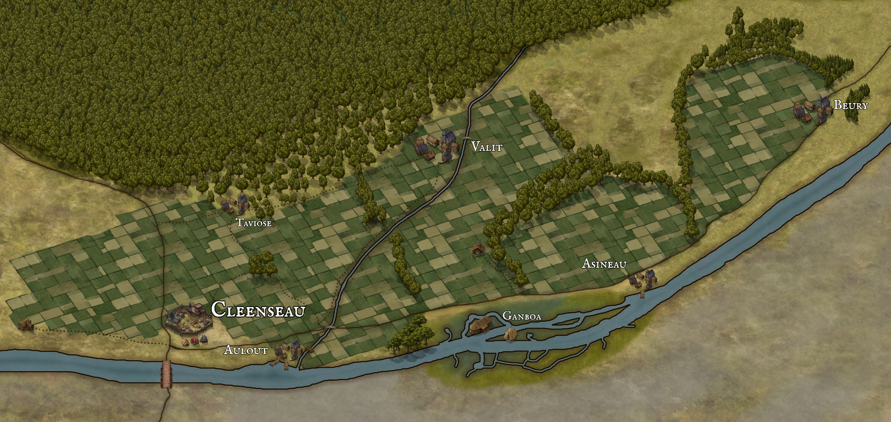

# The Cleenseau Region

-    :octicons-location-24:{ .lg .middle } A region in the [Barony of Aveil](<../barony-of-aveil.md>), [Sembara](<../../sembara.md>), the [Western Green Sea Region](<../../../../western-green-sea/western-green-sea-region.md>)  

The four manors of [Cleenseau](<./manor-of-cleenseau.md>), [Valit](<./manor-of-valit.md>), [Beury](<./manor-of-beury.md>), and [Asineau](<./manor-of-asineau.md>) form a relatively isolated part of the [Barony of Aveil](<../barony-of-aveil.md>), anchored by the market town of [Cleenseau](<cleenseau/cleenseau.md>) and its ancient and famous bridge - the only bridge anywhere on the [Enst](<../../../rivers/wistel-enst-watershed/enst.md>), and the only safe crossing for many miles. Perhaps without the bridge the region would have faded away after the [hobgoblin wars](<../../../../../history/third-hobgoblin-war-sembara.md>), but the bridge and the transportation nexus it creates supports a [garrison](<../../../../../groups/sembaran-army/army-garrison-of-cleenseau.md>) and market much larger than might be expected. Around these the town of [Cleenseau](<cleenseau/cleenseau.md>) thrives. 

The region is bounded by the [Enst](<../../../rivers/wistel-enst-watershed/enst.md>) in the south, [boggy land past Beury](<./east-bog.md>) in the east, the [Cleenseau Wood](<./cleenseau-wood.md>) in the north, and abandoned and rocky scrublands in the west, and is home to seven settlements: [Cleenseau](<cleenseau/cleenseau.md>) itself, the hamlet of [Taviose](<./taviose.md>), the fishing villages of [Auloutte](<./auloutte.md>) and [Asineau](<./asineau.md>), the small village of [Valit](<./valit.md>), the lizardfolk hamlet of [Ganboa](<./ganboa.md>), and the larger agricultural village of [Beury](<./beury.md>).

The [Enst](<../../../rivers/wistel-enst-watershed/enst.md>) dominates the landscape. It runs swiftly in the spring as snowmelt from the mountains and spring rains pour towards the sea, and in the spring floods are common. This far upstream, the river is shallow and wide, and the shoals often shift, making navigation difficult, and no boats come farther upriver than [Rinburg](<../rinburg.md>), 60 miles downriver. But small fishing rafts do catch the numerous river trout. The lifeblood of the region, however,  are the two major roads that intersect just outside the gates of [Cleenseau](<cleenseau/cleenseau.md>): the [Great South Road](<../../../roads/great-south-road.md>) and the [South Watch Road](<../../../roads/south-watch-road.md>).  

The nearest villages to Cleenseau along the road to the east are the fishing village of [Auloutte](<./auloutte.md>), nestled along the riverbank, and [Valit](<./valit.md>), an hour’s walk north of the road. A small brook, the [Amance](<./amance-brook.md>), crosses the road near [Auloutte](<./auloutte.md>), and the track to [Valit](<./valit.md>) runs north along this brook. A marshy bend in the Enst beyond [Auloutte](<./auloutte.md>) is the home to [Ganboa](<./ganboa.md>), a small community of lizardfolk, who are often seen along the riverbanks as far west as [Cleenseau](<cleenseau/cleenseau.md>). Beyond the marsh is another fishing village of [Asineau](<./asineau.md>), and then [Beury](<./beury.md>), most of a day’s walk to the east. Beyond [Beury](<./beury.md>) the land is wetter and poorly drained, and the [East Bog](<./east-bog.md>), as the next fifteen miles are sometimes called, is home to several abandoned villages, and said to be haunted by the ghosts of those who died in the Blood Years. This part of the road is travelled over swiftly, and always in daylight, if possible.

Beyond the marshes the land improves, and there is much good pasture around the village of [Dallet](<../dallet.md>), and then beyond that a string of fishing villages and farming towns until, 40 miles past Dallet, the town of [Rinburg](<../rinburg.md>), at the head of navigation of the Enst - but these places are far outside the region.

Further west, the [Gastant Farm](<./gastant-farm.md>) is one of the few farmhouses outside the villages, and sits two miles down a track, and the [South Watch Road](<../../../roads/south-watch-road.md>) runs past [Taviose](<./taviose.md>), a small hamlet on the edge of the [Wood](<./cleenseau-wood.md>), and then continues roughly straight for 80 miles through the wilderness until the settlements around [Dunfry](<../../western-marches/dunfry.md>). 

To the southwest a small track runs along the Enst for two miles, to the [Gastant Farm](<./gastant-farm.md>), and then continues for about a day's walk before it peters out. Folks say it used to go all the way to the North Fork, a branch of the Enst some hundred and fifty miles away, but now it has been reclaimed by the wild. 

To the south, the rocky shrubland dominates for a hundred miles, before reaching the rolling valleys near [Valarin](<../../../duchy-of-maseau/valarin.md>), where most of the people of [Maseau](<../../../duchy-of-maseau/duchy-of-maseau.md>) live. The road used to be dotted with inns and waystations, but these have fallen into disrepair since the Great War. This stretch of road is often called [Bandit's Way](<../../../roads/bandit-s-way.md>), and many ex-soliders make a living escorting caravans between Cleenseau and Evis, the northernmost settlement in Maseau along the Great South Road.

