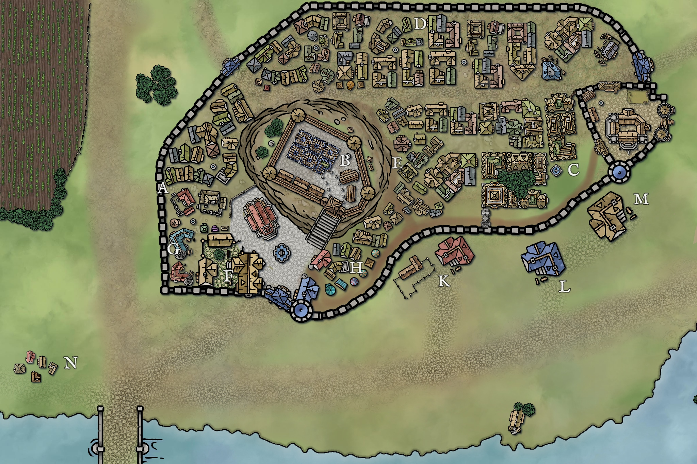

# Cleenseau
*(Klen-sew)*
>[!info]+ Information
> pop. 1,189
> 
>> 

Cleenseau is a small market town of fifteen hundred souls, nestled on the north bank of the River Enst. Situated at a major crossing of the river, it is a natural gathering place and trade crossroads. The reason for the town’s existence, and most important feature, is the massive stone bridge over the River Enst. Built a thousand years ago by the Drankorians (or perhaps, even longer ago by the Giants, some scholars say), it is wide enough for eight oxen; it spans the 1200 feet of the Enst in ten graceful arches.

In addition to trade from the south, Cleenseau is known for its fine metalworking community.

The town of Cleenseau itself stands some five hundred yards from the river, just beyond the road as it curves to follow the course of the river east. The soil here is rocky and poor, and the landscape a mix of small wooded copses and rocky shrubland. The immediate surroundings of the town are fields, hardwon from the rocky soil, and to the east a large cowpasture and woodlot. In the summer, a handful of wooden docks appear along the bank, and small rafts fish for river trout, but these docks often wash away in the spring floods. The lifeblood of the town is the trade that comes along the Great South Road - without the river crossing, the land would be too marginal to really support such a large concentration of people.  

Stretched along the southeastern wall of the town, between the wall and the road, are three inns: [The Bandit’s End](<./the-bandits-end.md>) (M),  [The River’s Blessing](<./the-rivers-blessing.md>) (L),  and [The Fox's Flagon](<./the-fox-s-flagon.md>) (K). But the largest and most important gathering place in the town is the halfling establishment known as the  [The Crossroads Inn](<./the-crossroads-inn.md>), an ancient, sprawling building built against the town walls near the south gate. 

Past the inns, at the northeast end of town, is a large open field with several large, open-sided buildings. This is the town market. Every Sunday and Tuesday it is full of merchants selling wheat, pigs, fish, beef, millet, charcoal, and other staples of everyday life. It attracts many of the villagers east of the river, who often stay the night at [The River’s Blessing](<./the-rivers-blessing.md>).  

The city walls are shaped like a bean, running north, then curving east before turning south, and then curving back southwest. Inside the walls are about two hundred houses, clustered tightly together in four neighborhoods:

* The South Close (A, on the map), between the [River Gate](<./river-gate-of-cleenseau.md>), the [Essford Manor](<./essford-manor.md>) (B), and the [North Gate](<./north-gate-of-cleenseau.md>) is drier during the spring and summer rains, being on slightly higher ground than the rest of the town, and is where the richer peasants and small artisans live. [The Crossroads Inn](<./the-crossroads-inn.md>) (F), on the west side of the gate, is also here as is Smith's Way (G), where several smiths ply their trade.
* The Garrison Quarter (C), in the east, is clustered around the [army garrison](<../../../../../../groups/sembaran-army/army-garrison-of-cleenseau.md>), and is where the wealthiest live
* The North Close (D), in the north, stretches along the wall from the [North Gate](<./north-gate-of-cleenseau.md>) to the [Garrison Gate](<./garrison-gate-of-cleenseau.md>) and and is where many of the farmers live. 
* Underhill (E on the map), is the poorest neighborhood, and stretches along the base of the [Essford Manor](<./essford-manor.md>) hill

Three paths lead through the town:
* A narrow dirt track (known as Char Street) runs along the interior of the southeast wall, lined with a number of small food stalls and shops (H). 
* A paved road leads from east to west, between the Market Gate and the North Gate, and divides the North Close from the Garrison Quarter and Underhill
* A narrow track along the edge of the raised Essford Manor provides a shortcut from south to north

In the center of the town, the Essford Manor stands on an acre of raised land surrounded by its own wooden palisade. Outside the walls of the manor is a small square with a large cistern fed by an underground pipe system drawing water from the Enst. A further pipe system brings running water to some of the richer houses in the South Close, including the Essford Manor and the [The Crossroads Inn](<./the-crossroads-inn.md>). 

There are four gates into the walled city: the North Gate, the Market Gate (in the east), the Garrison Gate (in the east, opening to the garrison  itself), and the River Gate (in the south, the main gate). All the gates are locked at night and staffed during the day by the lord’s household guard. Passage in and out of the city is unrestricted, but carrying weapons or wearing masks is not allowed save for members of the lord’s household or the [Army of the West](<../../../../../../groups/sembaran-army/army-of-the-west.md>).

On the south bank of the Enst, across the bridge, stands a large ruined garrison, the walls still standing but the roof collapsed, a reminder of a by-gone age when this was a major highway between the [Istabor Alliance](<../../../../../../history/istabor-alliance.md>) and [Sembara](<../../../sembara.md>). 

On the north bank, outside of the walls and west of the town, is a small cluster of single-room huts, often called Beggar’s Way (N). It is where the very poorest in the town eek out a living as day laborers.
`

*Distances and travel times
		to Rinburg, 60 miles (6 days on foot, or one and a half on a good horse)
		to Dunfry, 110 miles, along the South Watch Rood (10 days on foot, or three on a good horse)
		to Ainwick, 190 miles through untracked woods
		to Valarin, 130 miles (two weeks on foot, or four days on a good horse, or about 10 days for the merchant caravans)

