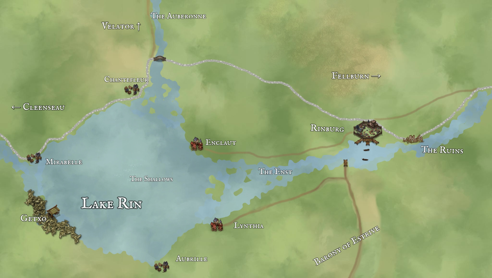

# Rinburg
:speaker:{ .middle } *(Rin-burg)*  

-  
    :octicons-people-24: pop. 2,341  
    :octicons-location-24:{ .lg .middle } A free city in the [Barony of Aveil](<./barony-of-aveil.md>), [Sembara](<../sembara.md>), the [Western Green Sea Region](<../../../western-green-sea/western-green-sea-region.md>)  

A trading town at the head of navigation of the [Enst](<../../rivers/wistel-enst-watershed/enst.md>). A busy ferry crosses the river here, and it is the only place to cross the Enst until [Cleenseau](<cleenseau-region/cleenseau/cleenseau.md>), sixty miles further west. The landscape around Rinburg is pastoral fields and farms, and there is much good sheep pasture within two days ride. Rinburg is named for [Lake Rin](<./lake-rin.md>), a large lake just upriver, which is also a rich source of fish. 

Rinburg is a free city, not under the control of any baron, and owes taxes and allegiance to the [Duchy of Wisford](<../heartlands/duchy-of-wisford.md>), rather than the [Barony of Aveil](<./barony-of-aveil.md>). The town hosts a bustling market as well as a robust ceramic industry and a productive timber industry.

The economic strength of Rinburg is derived from three areas:

* A thriving ceramics trade, particularly focused on jars and similar storage items
* A robust local industry in timber and masonry
* A center of trade within the [Barony of Aveil](<./barony-of-aveil.md>), primarily in leathers, grain, beef, and wool

There are three major guilds:

* the Ceramics Guild, which controls the manufacture and trade of ceramic goods, mostly for export downriver
* the Masons Guild, which controls the local building trade, as well as the timber industry
* the Mercantile Guild, which controls the local markets as well as the ferries and docks on the Enst

The most notable building in town is the large Temple of the Night Queen. There is also a small temple of the Wanderer and a larger Temple to the Father, built by [Cece I](<../../../../people/historical-figures/sembaran-royalty/cece-i.md>).

The current Lord Mayor is [Alaric Benec](<../../../../people/sembarans/alaric-benec.md>). 

### History
Although the shores of [Lake Rin](<./lake-rin.md>) have been settled for time immemorial, the current city is quite new, having been founded by a royal grant on [Viatela](<../../../../time/holidays-and-festivals/viatela.md>) in 1648. The previous city, known locally as "the ruins", still stands 2000 feet downriver although it has been much ransacked for building supplies. When the hobgoblins were retreating from the old city of Rinburg in the face of the Radiant Alliance, they lit massive fires, and by the time the city was recaptured there was little to save and rebuilding seemed more prudent. The old city had a bridge over the Enst, but it has never been rebuilt. Local superstition holds that the bridge was part of why Rinburg fell during the [the hobgoblin wars](<../../../../history/third-hobgoblin-war-sembara.md>) and there is significant local resistance to ever rebuilding it.

Rinburg grew quickly during the golden years of [Cece's](<../../../../people/historical-figures/sembaran-royalty/cece-i.md>) reign and is today prosperous and bustling, with a sense of possibility.
### Local Environment
Rinburg itself is set at a wide point on the [Enst](<../../rivers/wistel-enst-watershed/enst.md>), where the river runs deep on the north bank and boats can dock. The river is wide here, almost a quarter mile across, although it narrows substantially near the ruined old town.

### Governance
Rinburg is governed by a Lord Mayor, who is elected by the Council of Supervisors once every seven years. The Council of Supervisors consists of:
* The head and deputy for each of the three major guilds
* The head of each of the five minor guilds (the Baker's Guild, the Tanner's Guild, the Clothier's Guide, the Cooper's Guild and the Chandler's Guild)
* The chief counselor of each ward

The Council of Supervisors appoints magistrates for each ward, as well as three chief magistrates, a captain of the sheriffs, a captain of the wall, a keeper of the city purse, the dock master, the gate master, and the Lord Mayor, who serves as a spokesperson, and day-to-day manager, but has limited independent power and can be removed by majority vote of the Council of Supervisors at any time.

### Wards
The wards of Rinburg are:

* Wharfside, by the river, known for the bustling docks
* Templesward, known for its spacious boulevards and a wide plaza that is home to the Temple of the Night Queen
* Mudlathes, the potter's quarter, the known for Cruxe Way, a busy lane that twists amongst the many ceramics factories
* Stoneyards, the mason's quarter
* Westgate, a richer quarter by the western gates
* North Market
* Newtown, the newest quarter, often cramped
* Fenswick, the name for the settled land outside the walls and to the east, drawing near to the ruins

*Distances
		to [Fellburn](<../heartlands/fellburn.md>), 95 miles
		to [Cleenseau](<cleenseau-region/cleenseau/cleenseau.md>), 60 miles
		to [Dallet](<./dallet.md>), 40 miles

