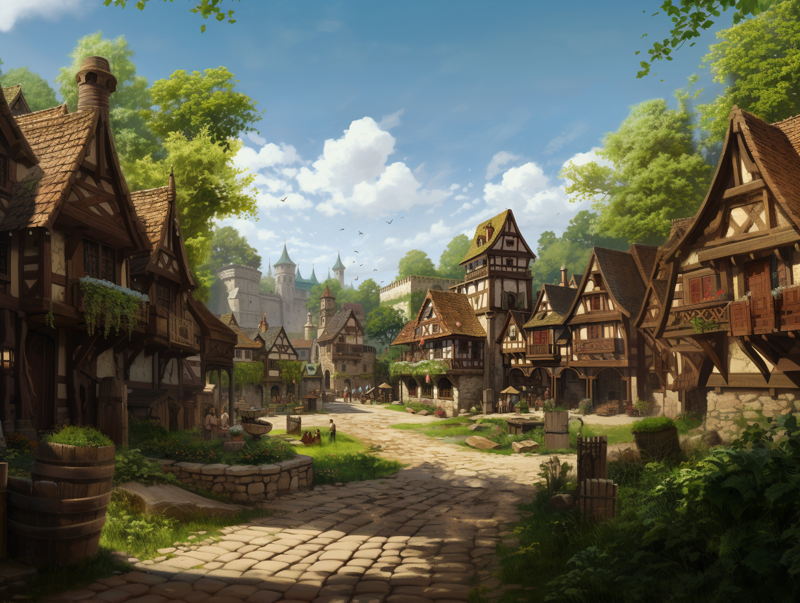

# Fairgate Outer

-    :octicons-location-24:{ .lg .middle } A ward in the [Free City of Tollen](<./tollen.md>), the Western Green Sea Region  

One of the wards of [Tollen](<./tollen.md>) that sits outside the walls of the city proper, that in many ways functions more like a large village than part of Tollen itself. The most prominent landmark is the Fairgrounds, a large open field that is set aside for the use of traveling halfling caravans, and often holds impromptu markets, celebrations, and events. 

Many [halflings](<../../../species/halflings.md>) who settle in Tollen live in Fairgate Outer, and it has several notable halfling inns and taverns, including [The Singing Fox](<./the-singing-fox.md>), known as a lively place to hear songs and stories, which is set on a small village square, with a well, across from a small temple of [The Mother](<../../../gods-and-religions/gods/incorporeal-gods/mos-numena-pantheon/the-mother.md>). 

The area has substantial agricultural, particularly on the fields to the west that gently slope down to the Little River, the dividing line between Fairgate Outer and the tanneries of Brooklawn Outer. Small plots of barley, oats, root vegetables, and hardy greens cluster here, although the air changes sharply at the river, with the acrid smell of curing hides wafting over the fields when the wind is from the west. 

The densest settlement is clustered around the walls, and particularly the Fair Gate, which sees a significant traffic. 

