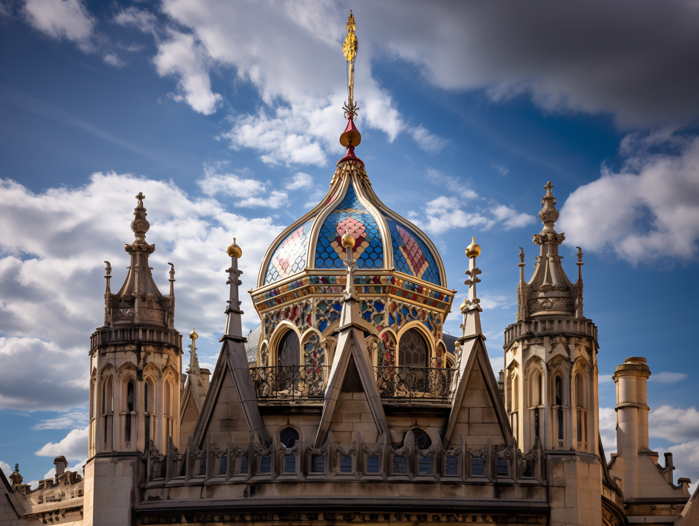
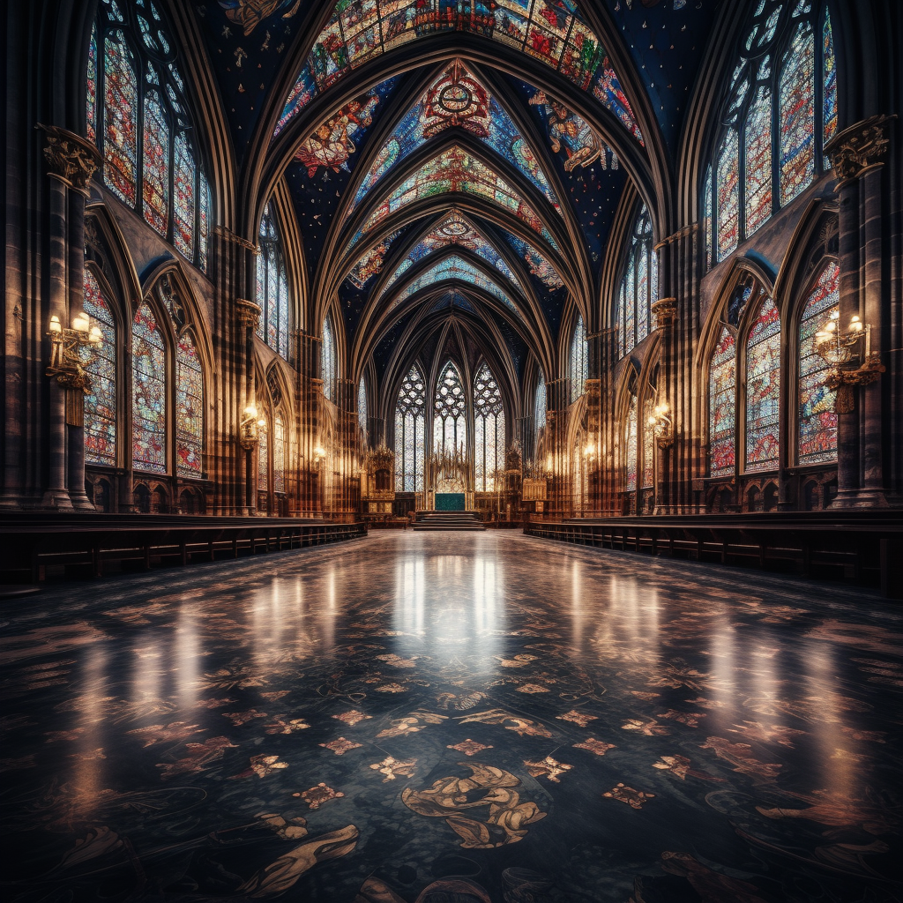

# The Temple of the Sibyl (Tollen)

-    :octicons-location-24:{ .lg .middle } A temple of [The Sibyl](<../../../../gods-and-religions/gods/incorporeal-gods/mos-numena-pantheon/the-sibyl.md>) in the [Free City of Tollen](<../tollen.md>), the [Western Green Sea](<../../../western-green-sea/western-green-sea.md>)  

The Temple of the Sibyl in [Tollen](<../tollen.md>) is a vast domed temple in [Godshome](<../wards/godshome.md>), its graceful, colorful dome one of the most prominent landmarks on the city’s skyline. Inside, light from high stained‑glass windows spills across tiled marble floors in shifting bands of color, an effect much remarked on by visitors and clergy alike.

