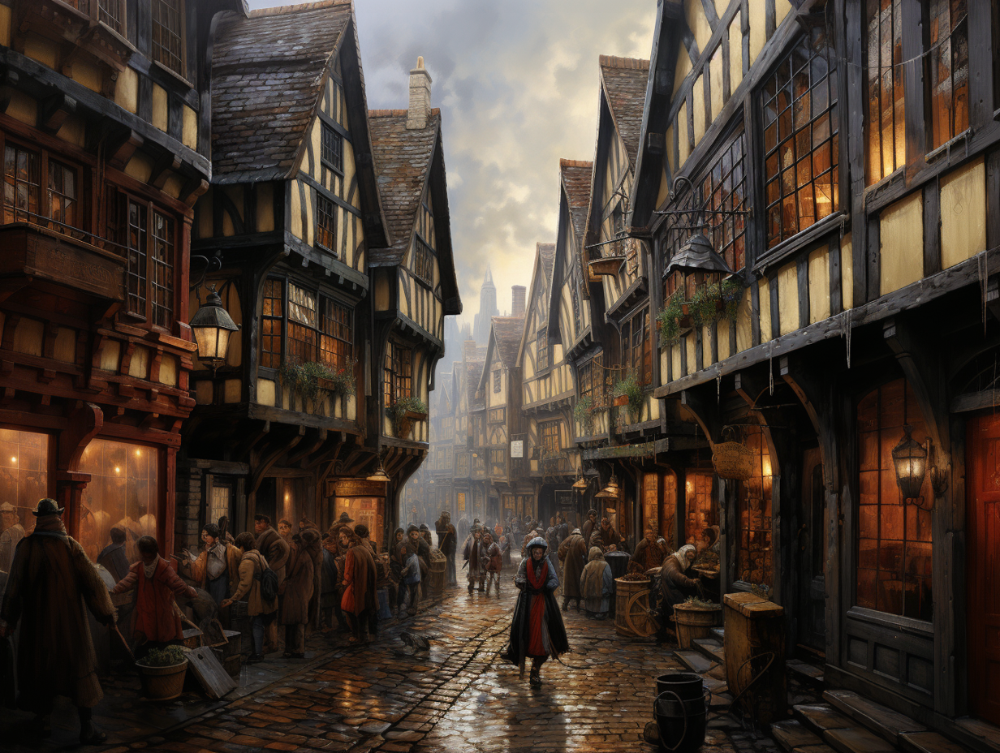
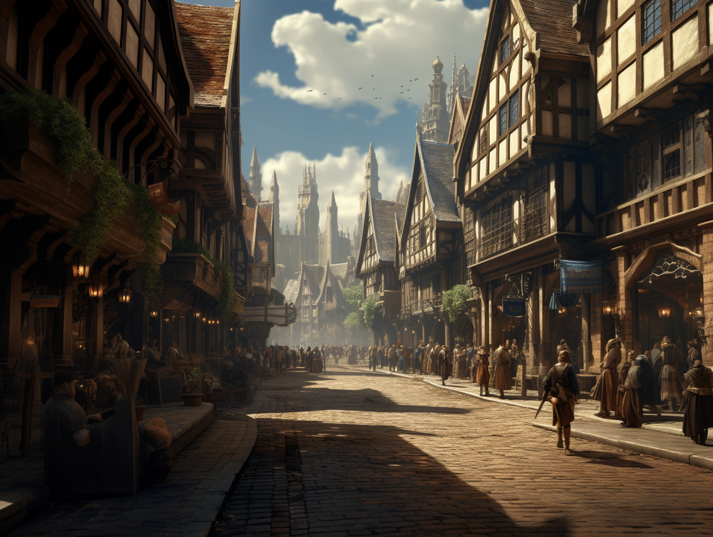
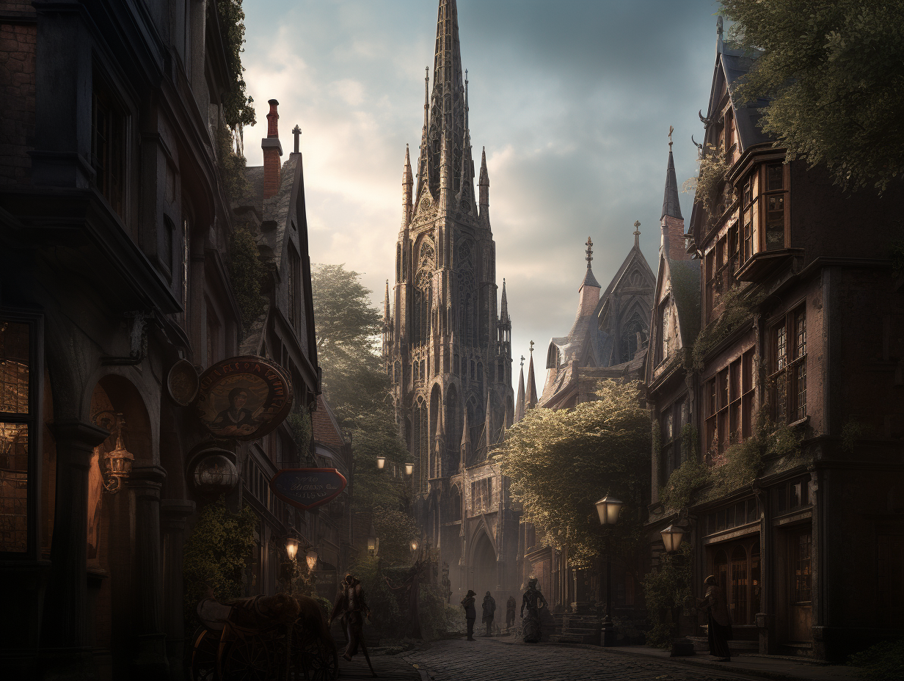
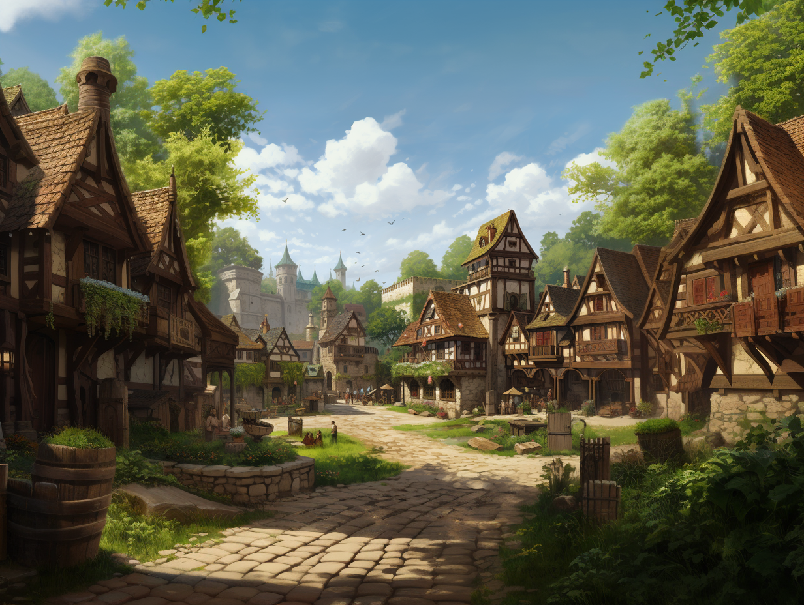

# Wards of Tollen

(1) **[Skepwalk](<wards/skepwalk.md>)** is the busy sea-facing waterfront of Tollen, lined with deep quays, cranes, and warehouses where tall-masted ships load and unload cargo from across the Green Sea.

(2) **[Fiskurth](<wards/fiskurth.md>)** is the fishing ward, a cramped stretch of low docks, fish-stalls, and sailor’s inns where the inshore fleets bring their catch ashore at dawn.

(3) **[Aesganstrad](<wards/aesganstrad.md>)** is the ancient core of Tollen, a tangle of narrow streets, leaning houses, and strange old statues to forgotten heroes. 

(4) **[Magus Street](<wards/magus-street.md>)** is the university district, crowded with bookshops, lecture halls, boarding houses, and student taverns spilling arguments and minor magic into the lanes.

(5) **[Nordgate](<wards/nordgate.md>)** is the dwarven-leaning craft ward around the old north gate, full of stone-fronted workshops and forges.

(6) **[Bridgeward](<wards/bridgeward.md>)** is the market front of the [Tollen Bridge](<places/tollen-bridge.md>), where carts, stalls, and shops cluster around market squares. 

(7) **[Southbridge](<wards/southbridge.md>)** is the south-bank bridge ward, where exclusive magical tattoo parlors coexist with small dyers, cheap lodgings, and street artists.

(8) **[Godshome](<wards/godshome.md>)** is the temple district, its streets winding between crowded shrines, great houses of the Eight Divines, the [Temple of Kaikkea](<places/temple-of-kaikkea.md>), and smaller, stranger faiths.

(9) **[Guildgate](<wards/guildgate.md>)** is the hill of guildhalls and merchant houses, where rich guilds keep their meeting rooms, gardens, and courts and send delegates to the Great Council.

(10) **[Gold Street](<wards/gold-street.md>)** is the main commercial avenue of Tollen, a district of broad streets, counting-houses, and moneylenders where large deals are struck and recorded.

(11) **[Fairgate](<wards/fairgate.md>)**, split into [Fairgate Inner](<wards/fairgate-inner.md>) and [Fairgate Outer](<wards/fairgate-outer.md>) is the western gate district, a mix of markets, caravan inns, and halfling homes linked to the [Fairgrounds](<places/fairgrounds-tollen.md>) and the farms of [Fairgate Outer](<wards/fairgate-outer.md>).

[Fairgate Outer](<wards/fairgate-outer.md>)

(12) **[Haurhill](<wards/haurhill.md>)** is the rise above the [Little River](<../rivers/volta-watershed/little-river.md>), built around the remains of an old Drankorian fort.

(13) **[Battery](<wards/battery.md>)** is the fortified south-bank ward at the harbor mouth, home to naval yards, shipbuilding slips, and large fish-processing sheds.

(14) **[Brooklawn](<wards/brooklawn.md>)**, split into [Brooklawn Inner](<wards/brooklawn-inner.md>) and [Brooklawn Outer](<wards/brooklawn-outer.md>), is the tanners’ and dyers’ district along the Little River, packed with vats, canals, smokehouses, and workshops that turn hides and cloth into Tollish trade goods.

(15) **[Riversgate](<wards/riversgate.md>)** is the upriver barge and timber ward, where rafts of logs, grain barges, and other river cargo tie up at low quays and feed the city’s warehouses.

(16) **[Fenslane](<wards/fenslane.md>)** is a south-bank ward on reclaimed marsh, with plank-walked lanes, modest houses, and workshops for the dockworkers and families who live near the river.

(17) **[Tideswell](<wards/tideswell.md>)** is the outer south-bank waterfront, a poorer strip of shacks, stilt-houses, fish sheds, and small yards, prone to flooding at high tide.
