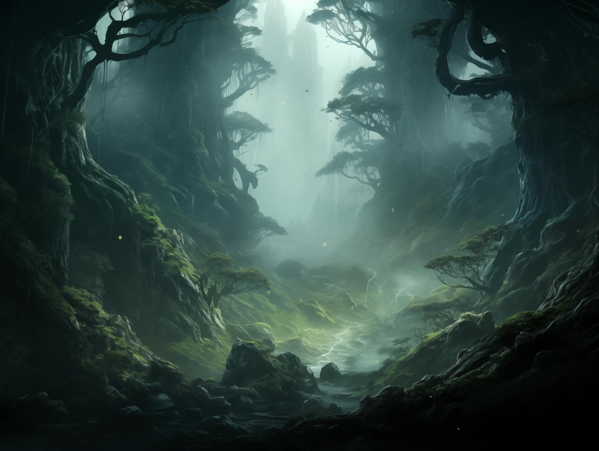

# Orenlas
:speaker:{ .middle } *(o-REN-las)*  

-    :octicons-location-24:{ .lg .middle } An [elven](<../../../species/children-of-the-embodied-gods/elves/elves.md>) forest realm in the [Istaros Watershed](<../istaros-watershed.md>)  

The elven forest of Orenlas is the last remnant of the ancient forests of [Alcarinque](<../../../history/pre-downfall/alcarinque.md>), once home to the great elven civilizations of the days of myth. Orenlas is one of the few places in the world where the magic of those days still lingers. Here can still be found the great dreaming trees of the [elves](<../../../species/children-of-the-embodied-gods/elves/elves.md>), still echoing the song of [Aldanor](<../../../cosmology/gods/embodied-gods/aldanor.md>). It is one of the oldest, if not the oldest, still-standing forests on Taelgar. 

Orenlas proper occupies the forest southeast of ~Lake Cymea~ and southwest of the [~Cymea Border Mountains~](<../../western-green-sea/cymea-border-mountains.md>), north and east of the [Plaguelands](<../plaguelands.md>), an area about 140 miles east to west and 80 miles north to south. Dense mists cling to these woods, and the trees listen. It is rumored that those who are unwelcome find paths closed to them, turned in circles until they find themselves outside the forest again. Those who would do harm are led to more permanent fates. 

*The twisted paths of Orenlas can led the unwary or the unwelcome to hidden dangers.*

Walking through the forest, however, creates a sense of timelessness. The days turn to nights, but hours don't seem to pass at a constant rate, and it is easy for a week to feel like a day, or a day a week. The seasons and the weather are only loosely related to the outside world. There is a faint echo here of the days of creation, before time began, and when the gods still walked the earth. 

While many [elves](<../../../species/children-of-the-embodied-gods/elves/elves.md>) live in small settlements in Orenlas, there is one major city, called [Erelion](<./erelion.md>), that is claimed to be the oldest continually occupied settlement on Taelgar. 