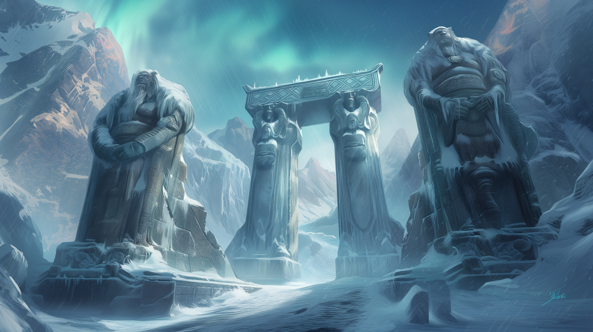
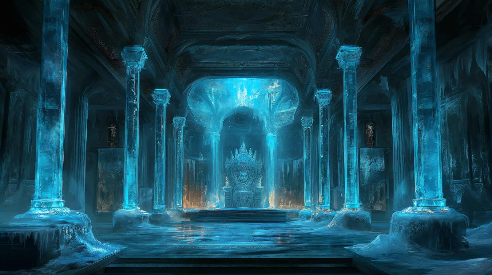

# Isenborg
:speaker:{ .middle } *(EE-zen-borg)*  

-    :octicons-location-24:{ .lg .middle } A frost giant steading [Kaldhalla](<./kaldhalla.md>)  

Isenborg is the primary steading of [Kaldhalla](<./kaldhalla.md>), and the hall of the king, [Brimskarda](<../../people/giants/brimskarda.md>). 

## Approach

{align="right"; width="500"}Isenborg is located on the shoulder of a tall peak in the Hrimthur range, in the shadow of the mountain the frost giants call Spirenevald (SPEER-ehn-vahld). The northern lights constantly dance over the steading, even in daytime, giving it a strange magical glow, and illuminating the massive walls of ice and stone that encircle the steading. 

The entrance to Isenborg is marked by a grand, frozen gate, adorned with intricate carvings of frost giants' myths and battles. Sentinel ice sculptures, crafted to look like fearsome beasts and legendary giants, guard the pathways.

## The Steading

Within the walls of the steading lies a spacious courtyard, covered in snow, cold firelight flickering everywhere, providing light but not warmth. Training grounds, arenas for combat practice, and pens that house giant mammoths and massive goats, all dot the interior, along with several massive giant-sized dwellings. Carved into the glacier walls are warrens of smaller housing for servants, lined with fur.

## Brimskarda's Palace

{align="right"; width="500"}Brimskarda's Palace is the most notable landmark in Isenbord. The palace is a marvel of ice architecture, towering spires and domes crafted from blue and white ice, shimmering like a mirage. Giant-sized steps lead up to the main entrance, flanked by ice columns that radiate a soft, ethereal glow. Enormous ice sculptures of the frost giant's gods and ancestors decorate the palace facade.

Inside, the great hall is vast, with ceilings lost in shadow, supported by pillars of ice. The hall is dominated by the view of Brimskarda's throne, carved from glacial ice, seated upon a raised dais, with a long, frost-encrusted carpet leading up to it. Tapestries depicting Brimskarda's victories in battle line the walls, and everything is illuminated with a icy blue light. 

Many of the frost giants of Isenborg live in the palace itself, in spacious quarters, with furnishings carved from ice and stone, covered in furs and pelts of mythical beasts. The royal chambers are especially lavish, with tapestries made from the feathers of frost phoenixes and beds of polar bear fur.

