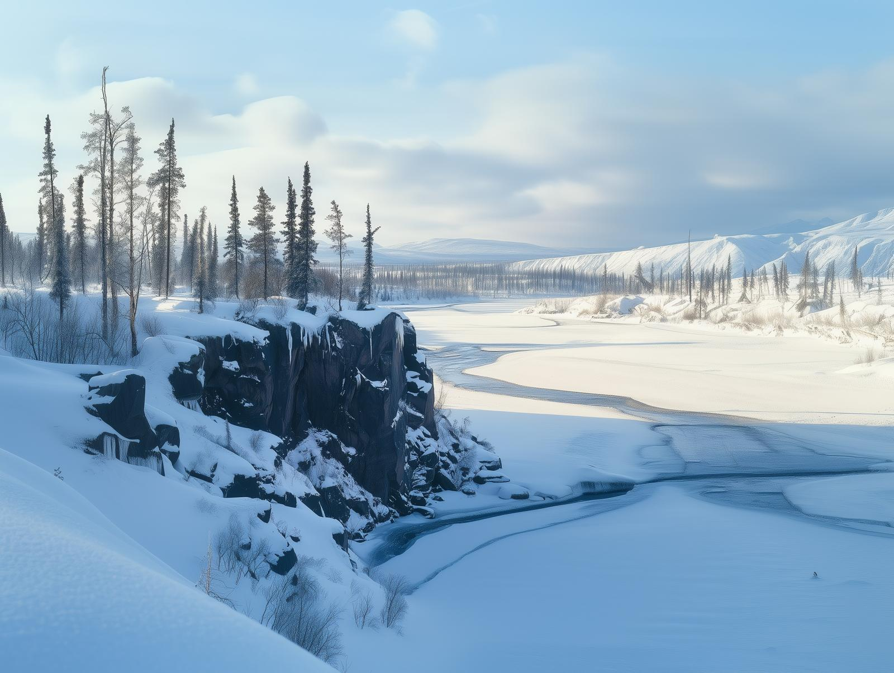

# Ket

-    :octicons-location-24:{ .lg .middle } A river in the [Northern Green Sea](<../northern-green-sea.md>)  

The Ket is the most significant river of the [~Northern Boreal Forest~](<../northern-boreal-forest.md>), flowing over 1500 miles from its source on the eastern slopes of the [Svinjo Mountains](<../svinjo-mountains.md>), east to the [Green Sea](<../../green-sea.md>). For most of its length, the Ket cuts through vast, uncharted stretches of taiga, dominated by dense pine and spruce forests, interspersed with birch groves. The river’s valley is home to countless species of boreal wildlife, including elk, wolves, and bears. In the summer, migratory birds flock to its banks, feeding on the abundant fish and insects, while the winter brings stark stillness, with thick snow blanketing the region.

{align="right"; width="400"}The river's climate is harsh and highly seasonal. For much of its length, the Ket freezes solid from late October to early April, with the ice reaching up to four feet thick during the coldest months. Spring is dramatic, as melting ice from the river and nearby mountains causes the river to swell, flooding nearby lowlands and creating temporary marshes teeming with life. By early June, the ice has cleared, and the river runs swift and cold, carrying meltwater and sediment toward the Green Sea.

The most significant settlement on the Ket is the [Urskan](<../ursk/ursk.md>) city of [Zvervinka](<../ursk/zvervinka.md>), near the river mouth, less than 100 miles inland from the coast. The Ket is also the lifeblood of the Vargaldi who call the [~Northern Boreal Forest~](<../northern-boreal-forest.md>) their home. 

