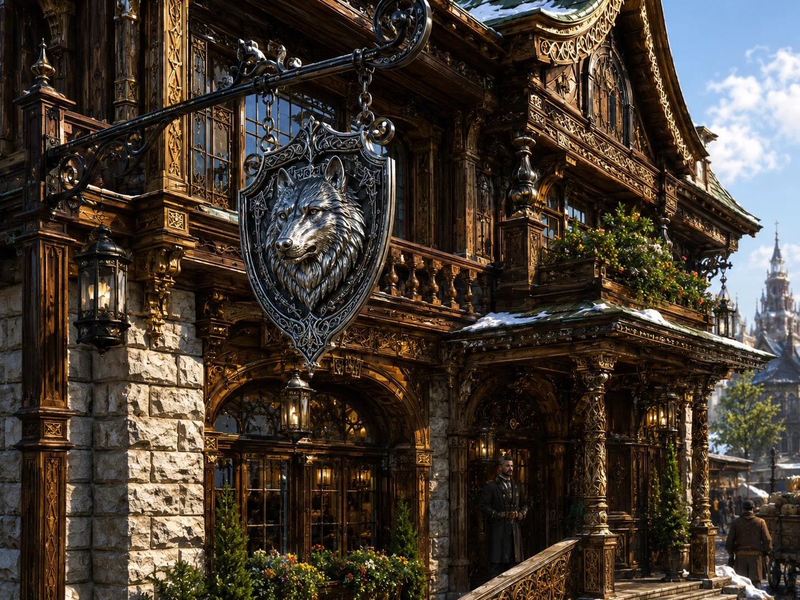

# The Silver Wolf

-    :octicons-location-24:{ .lg .middle } An inn in [Zvervinka](<zvervinka.md>), [Ursk](<ursk.md>), the [Northern Green Sea](<../northern-green-sea.md>)  

{align="right"; width="450"}The Silver Wolf is an upscale inn and restaurant in [Zvervinka](<zvervinka.md>), primarily catering to wealthy merchants in town for the large market. It is known for its extensive larder and skilled chef. 

