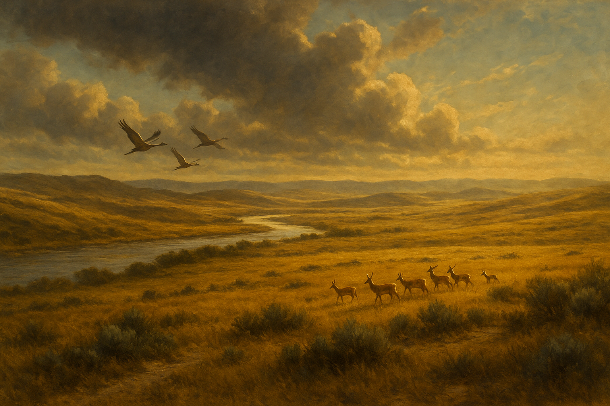

# The Erbalta Plains
:speaker:{ .middle } *(air-BAWL-tuh)*  

-    :octicons-location-24:{ .lg .middle } A plain in the [Northwest Coast](<../northwest-coast.md>)  
    :octicons-location-24:{ .lg .middle } Located in the [Northern Provinces](<../northern-provinces/northern-provinces.md>), the [Chardonian Empire](<../../greater-chardon/chardonian-empire/chardonian-empire.md>), [Greater Chardon](<../../greater-chardon/greater-chardon.md>)  

The Erbalta Plains are a large open steppe along the [Snake River](<../../major-rivers/chasa-nahadi-watershed/snake-river.md>) valley. This is a land of scrubby grass, wind-twisted sagebrush, and silver bunchgrasses; shallow coulees dot the lowlands along the river, their chalky banks bright with purple thistle, while dusty limestone bluffs rise softly in the highlands. Along the river, cottonwood groves and reed beds thrive, while herds of wild goats and pronghorn roam the plains and llamas occupy the highlands.

The Erbalta Plains are too dry for extensive agriculture outside of irrigated fields in riparian valleys, though barley, flax, and drought-tolerant pulses are common, and hay from riparian meadows is crucial to support animal stock. The Erbalta is excellent grazeland, and hardy sheep and goats are a common sight on the plains. 

## Borders

The Erbalata Plains refer to the entire [Snake River](<../../major-rivers/chasa-nahadi-watershed/snake-river.md>) valley grasslands in the rain shadow of the [Fiamatara Mountains](<../fiamatara-mountains/fiamatara-mountains.md>), stretching from the northernmost peaks in the range to the confluence of the [Snake River](<../../major-rivers/chasa-nahadi-watershed/snake-river.md>) and the [Zarnato](<../../major-rivers/chasa-nahadi-watershed/zarnato.md>), south of which the rolling hills become wetter and more wooded. While technically the [Chardonian Empire](<../../greater-chardon/chardonian-empire/chardonian-empire.md>) lays claim to this entire region, the [Chardonian Legion](<../../../groups/chardonian-organizations/chardonian-legion.md>) does not effectively control any territory north of the ~North Voltara Hills~. 

## Climate

Isolated from the moderating influence of the [Endless Ocean](<../../endless-ocean.md>) by the rugged [Tawir Forest](<../tawir-forest.md>) and the steep [Fiamatara Mountains](<../fiamatara-mountains/fiamatara-mountains.md>), the Erbalta Plains have a cold, semi-arid climate, with limited annual precipitation that mostly falls in the late winter and early spring. Summers and long, and often hot, dry, and windy, while winters are crisp with occasional light snowfall. Occasional spring and autumn squalls along the main river provide the brief growing season that sustains the region’s hardy grasslands and scattered riparian groves.

