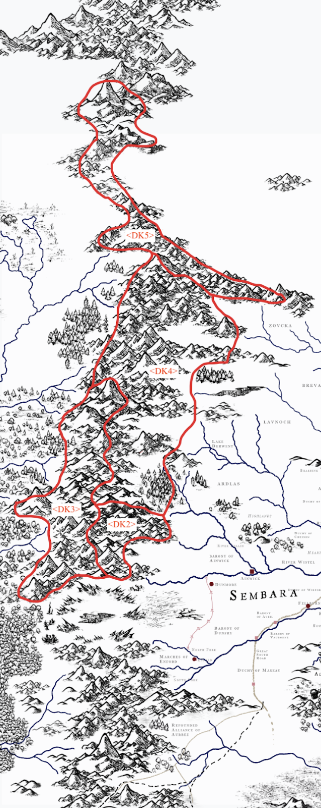

# The Dwarven Kingdoms

-    :octicons-location-24:{ .lg .middle } A realm in [Labkhan](<../sentinel-range.md>)  

The Dwarven kingdoms of the [Sentinel Range](<../sentinel-range.md>) have a long, deep history. Once, all the land under the mountains was part of the great Dwarven empire, stretching from the southern end of the mountains to the  far north. The heart of this empire was in the area that, in the current day, is just south of the devastation around the ancient [Urlich Pass](<../urlich-pass.md>). 

During [The Downfall](<../../../events/ancient/the-downfall.md>), when Hkar fell and great wars were fought in the depths underground below the mountains, the Dwarven empire was shattered, and many of the deeper cities were abandoned. However, many [Dwarves](<../../../species/children-of-the-embodied-gods/dwarves/dwarves.md>) survived, and while the [Drankorian Empire](<../../../history/drankorian-era/drankorian-empire.md>) was being established aboveground, the Five Kingdoms were growing below and among the [Sentinel Range](<../sentinel-range.md>).

{width="300"}
 
## [Ardith](<./ardith.md>)
In the far south, south of [Urlich Pass](<../urlich-pass.md>), is [Ardith](<./ardith.md>), growing rich on trade with [Drankor](<../../../history/drankorian-era/drankorian-empire.md>), and later with [Dunmar](<../../greater-dunmar/realms/dunmar/dunmar.md>), until at the end of the [Great War](<../../../events/1500s/great-war.md>) they were driven from their homes and settled south, in the [Yuvanti Mountains](<../../greater-dunmar/yuvanti-mountains.md>), founding [Nardith](<../../greater-dunmar/realms/nardith/nardith.md>). Now destroyed. 
## [Khatridun](<./khatridun.md>)
_Labeled DK2 on the map_

North of [Ardith](<./ardith.md>) is the kingdom of [Khatridun](<./khatridun.md>), centered on the great city of [~DwCity1~](<./dwcity1.md>), one of the oldest Dwarven cities in the world during the Drankorian Era. During the [Great War](<../../../events/1500s/great-war.md>), [Khatridun](<./khatridun.md>) was devastated, and [~DwCity1~](<./dwcity1.md>) was destroyed. Now, a remnant of this ancient kingdom survives on the border of [Sembara](<../../greater-sembara/sembara/sembara.md>). Once rich and prosperous on the trade between [Sembara](<../../greater-sembara/sembara/sembara.md>) and [Chardon](<../../west-coast/chardonian-empire/chardon/chardon.md>), [Khatridun](<./khatridun.md>) now looks inward to Dwarven history and the legends of the past.  

## [Am'khazar](<./am-khazar.md>)
_Labeled DK3 on the map_

West of [Khatridun](<./khatridun.md>) is the kingdom of [Am'khazar](<./am-khazar.md>), roughly "rich-iron-mountains." [Am'khazar](<./am-khazar.md>) has always been the center of mineral wealth in the [Sentinel Range](<../sentinel-range.md>), with deep mines and a rich trade in gemstones from [Zarkandur](<./zarkandur.md>), the City of Gems. 
## [Nidzahar](<./nidzahar.md>)
_Labeled DK4 on the map_

In the current era, [Nidzahar](<./nidzahar.md>) is the largest and richest of the dwarven kingdoms, known widely across the [Western Green Sea](<../../western-green-sea/western-green-sea.md>) and even as far as [Chardon](<../../west-coast/chardonian-empire/chardon/chardon.md>) as the source of a wide range of expertly crafted goods. [Nidzahar](<./nidzahar.md>) is the most technologically oriented of the dwarven kingdoms, and has the most extensive surface settlements. 
## [Fahnukan](<./fahnukan.md>)
_Labeled DK5 on the map_

In the far north, the dwarven kingdom of [Fahnukan](<./fahnukan.md>) is strange and isolated, with little contact with the southern dwarven kingdoms for the past many generations. 

  
