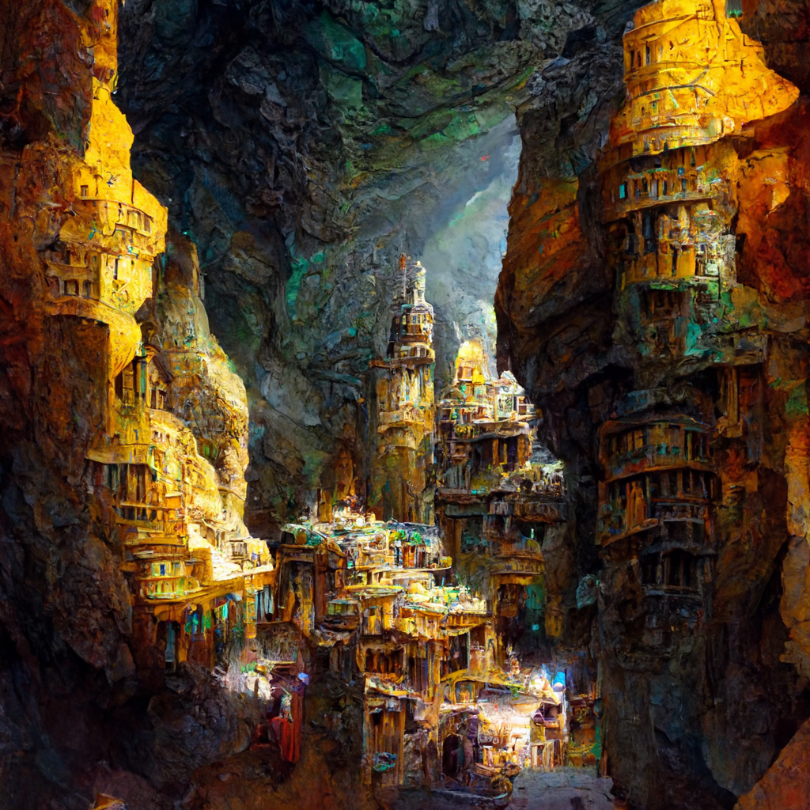

# Zarkandur

-    :octicons-location-24:{ .lg .middle } A [dwarven](<../../../species/children-of-the-embodied-gods/dwarves/dwarves.md>) city in [Am'khazar](<./am-khazar.md>), [Labkhan](<../sentinel-range.md>), [Central Highlands Region](<../central-highlands-region.md>)  

## Overview 

**Location**: In the kingdom of Am’khazar, on the western edge of the [Sentinel Range](<../sentinel-range.md>), deep underground.
**Size**: Although a relatively small city, Zarkandur is densely settled, with a population of 25,000 dwarves.
**Age**: Originally a waypoint on a long road, notable primarily for its natural beauty, Zarkandur grew into a town of minor importance 700 years ago, and flourished as a city of importance since the end of the Great War, 200 years ago.
**Condition**: Magnificent. This is a city of great beauty.
**Government**: Ruled by the clan chief and the city council, who are chosen by the elders but must be approved by the King of Am’khazar. 
**People**: Am’khazar, being fully underground, is a city of dwarves.

## Description

Zarkandur, the city of gems, is largely contained within a series of three large caverns that have been carefully tended and expanded by the dwarves over the centuries. The approach to the city, from the west along the Long Road, follows a wide passage to an enormous gate marking the entrance to the first cavern of Am’khazar. While the gate stands open except in times of danger or war, it is guarded and non-dwarves are questioned about their business. 

>[!info] A note on districts and names
>
> *Am’khazar is spread over three large caverns. The first and biggest, home to much of the government and finance of the city, is known as Highside (for its size and feeling of space, and also buildings and streets that head up the walls); the second, where a lot of the history and upper class estates are, is known as Brightcave (for the lights and beauty); the third, with the academy and the densest cave formations, is known as Crystalrun. Within these three ‘main’ districts there may be smaller neighborhood names.*

  
### Highside
On the other side of the gates is the vast cavern of the Highside district. While there is some housing here, much of the space is given over to three large central buildings, built to incorporate the natural features of the cavern into their architecture. This is the theater and art district of Zarkandur, where moving choral works, operas, and art shows of feats of craft and beauty can be seen. Great crystal lights float in the air illuminating the cavern. Highside is also where the real wealth of Zarkandur resides: the gemcutting district, known as Gemcutter’s Way. 

Along the south wall of the cavern, the artisans of Zarkandur work, turning the raw ore and unpolished stones from the mines to the east into polished gems to be traded across the [Dwarven Kingdoms](<./dwarven-kingdoms.md>), and eventually reach the outside world. The gemcutters of Zarkandur are renowned for their skill, although this area is not without strife, as four major clans vie for control over the gem trade: Silverhand, Highcrown, Rockanvil, and Steelhammer. The Steelhammer clan is currently in ascendance, as they have recently acquired an exclusive trade deal with several mining operations to the east for access to uncut rubies from a newly opened vein. The small governmental district is also in Highside, but unusually, is built as a warren of open caves and passages ascending the north wall of the cave. The government district also houses the storerooms for food, weapons, and other goods of critical importance to the city. 

### Brightcave
Above and east of Highside is the historic district of Brightcave. This is the rich area of the city, and is if anything even more impressive in its construction that Highside. The estates of the wealthy line the edges of the cavern, and the original historic district sits here as well, highlighted by a massive and beautiful Temple to the [Bahrazel](<../../../cosmology/gods/embodied-gods/bahrazel.md>). Completing this cavern is the arts district, where a number of artisans and craftspeople live, and where the Crystal Market sits, a combination of a market, gallery, art museum, ode to dwarven skill, and historic building. This is the original market of the trading settlement Zarkandur once was, elaborated on and expanded many times over the past 700 years. 

Stretching out from Brightcave are many passages. Many lead to smaller caverns, some of which hold family estates of the wealthiest dwarven clans, including Brelith’s family. One leads to the old spur of the Long Road, now abandoned, which has since been turned into a memorial for the dead of the Great War. Another leads to Crystalrun, the last district of the city.

### Crystalrun
Crystalrun is the smallest and least developed of the three caverns that make up Zarkandur, and remains more natural in appearance than the other caverns, which gives the district its name. The only structure here is the academy of history, built in a semi-circle around the perimeter of the cavern, and housing the archives, housing, and common space for the scholars who are part of the academy. 

The city is built in a series of natural caverns, and beneath the city twisting passages and hidden caves form a network that is navigable. While most of the undercity is empty, there is one place of note down here, a hidden fight club where (younger) dwarves brawl. Although not officially sanctioned by the town government, its existence is an open secret and it is not prevented from operating, being seen as a way to relieve some of the tension from the economic competition among the gemcutter clans. 

## History

Originally a waypoint on a long road, notable primarily for its natural beauty, Zarkandur grew into a town of minor importance 700 years ago, and flourished as a city of importance since the end of the Great War, 200 years ago. It took in many refugees at the end of the Great War, and the first generation of refugee children are now in their prime, which has given the city a vibrancy and life and energy that was often lacking in the past. 

## Vibe
The dominate vibe is of beauty and elegance, although how this plays out varies a bit among districts. Highside is the loudest and most boisterous of the districts, with significant nightlife and a young energy. Brightcave is quieter and more prone to traditional dwarven elegance expressed through art and craft. Crystalrun is the most quiet and the most centered on natural beauty. 

## Services
Almost any artisan or crafter can be found here, including magic shops specializing in armor and weapons. Gemcutters, jewelers, and similar are notably common. Spellcasting services (cleric or paladin spells, level 2 or lower) are available from the Temple in Brightcave; spellcasting services (wizard spells level 2 or lower) are also available from the Academy of History in Crystalrun. 