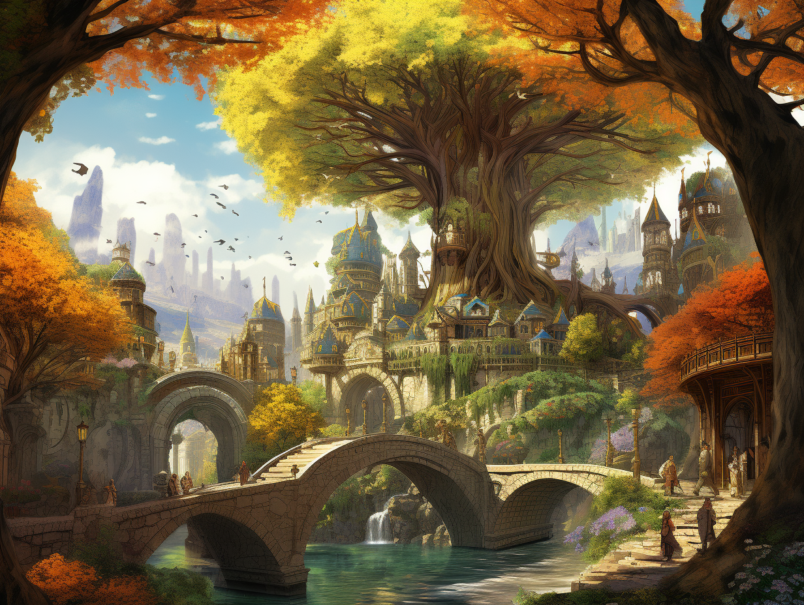
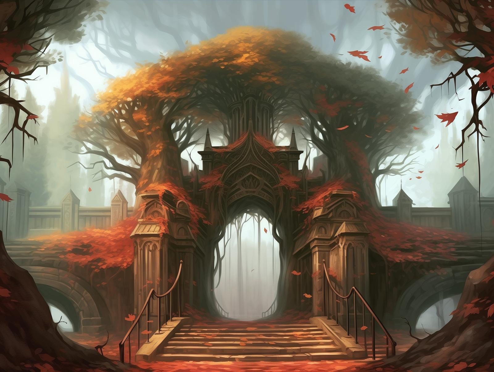
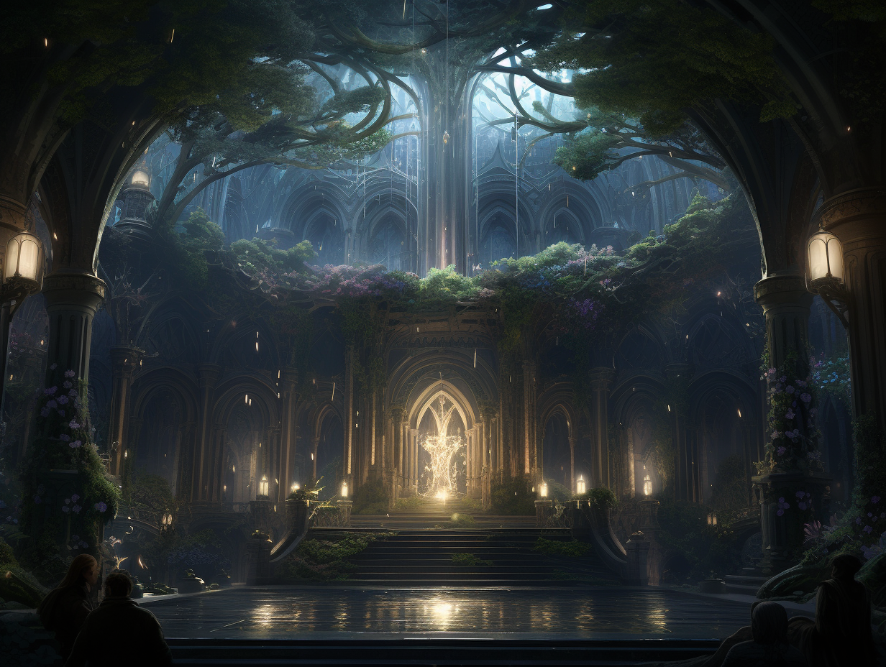

# Erelion
:speaker:{ .middle } *(air-LEE-on)*  

-    :octicons-location-24:{ .lg .middle } An [elven](<../../../species/elves.md>) city in [Orenlas](<./orenlas.md>), the [Istaros Watershed](<../../major-rivers/istaros-watershed/istaros-watershed.md>)  

## Overview
An ancient elven city in the kingdom of [Orenlas](<./orenlas.md>), claimed by many [elves](<../../../species/elves.md>) to be the oldest continually occupied settlement on Taelgar. 

Erelion is a living city, growing in and among the ancient forest of [Orenlas](<./orenlas.md>). Elaborate towers appear to grow from the surrounding trees and landscapes, their walls adorned with vines, leaves, and flowers. Bridges woven from living vines connect various parts of the city, allowing [elves](<../../../species/elves.md>) to traverse the canopy with grace. At night, the paths of the city are lit by bioluminescent plants and animals, their soft, soothing glow casting a dreamlike aura over the city.

*The city and the forest are intertwined around each other.*

Erelion is not organized around any plan or into distinct districts; it has an organic and magical feeling, where path part to reveal hidden gardens and secret pools. However, there are a few primary features and places in the city.
## The Gates of Erelion
All vistors to Erelion, no matter the direction they approach from, find themselves at the gates of Erelion. Those who are welcome find themselves expected; those who are not, find the city closed to them. 

*The gates of Erelion greet all visitors to the city.*

## The Elder Tree
A vast tree, standing at least 600 feet heigh, and measuring over 100 feet in diameter at its base, that grows in the center of Erelion. Vines and flowers cover the lower reaches of the tree, while the canopy spreads to cover the center of the city, with a diameter of 1000 feet or more. This is a place of prayer, to honer [Aldanor](<../../../gods-and-religions/gods/embodied-gods/aldanor.md>), where it is said the spirit of [Aldanor](<../../../gods-and-religions/gods/embodied-gods/aldanor.md>) lingers and can be shared in dreaming. 

The upper reaches of the Elder Tree are where the young elves, still in their dreaming spend the [mela](<../../../background/elven-cycle-of-generations.md>) of their birth. 

*The space for prayer and reflection in the great elder tree at the center of Erelion.*

## Fey Gardens
Erelion contains many hidden and unexpected gardens, often with unusual magic. All manner of things grows on plants here: delicate flowers with silver petals, vines laden with fruit, trees with a different spice growing from each branch, and wilder things can all be found in the gardens of Erelion. Some gardens perpetually maintain a particular season, while others rapidly turn from season to season over the course of a day, or a week. Ponds, waterfalls, and blooming flowers are a frequent feature of these gardens, and [Fey](<../../../species/extraplanar/fey.md>) creatures are not uncommon. Many of these gardens are in perpetual twilight, their serene pools reflecting the stars. 

